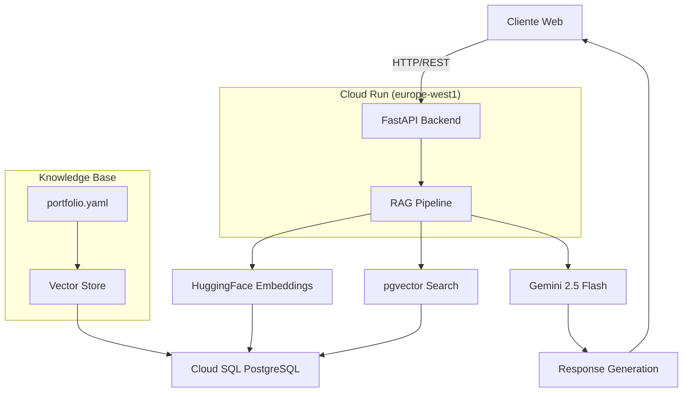
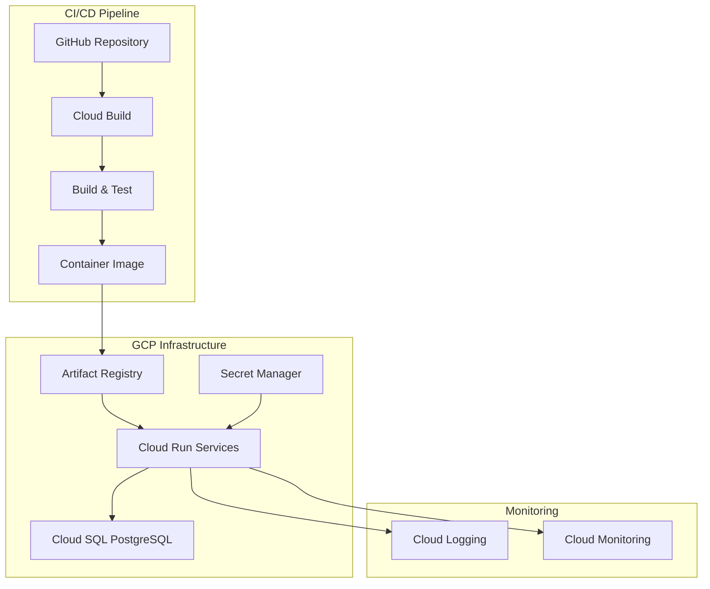
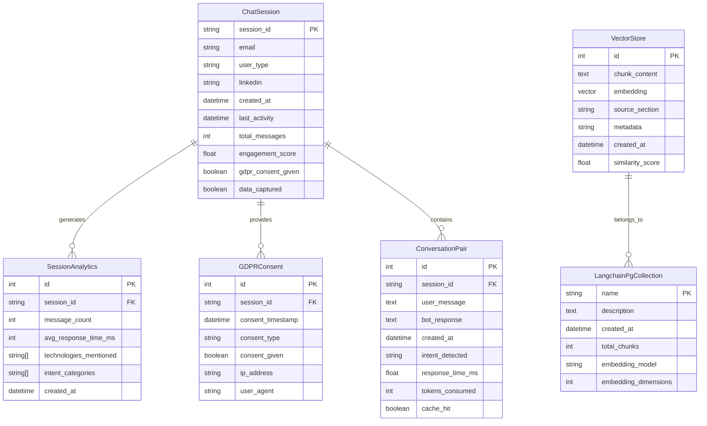

## Índice

0. [Ficha del proyecto](#0-ficha-del-proyecto)
1. [Descripción general del producto](#1-descripción-general-del-producto)
2. [Arquitectura del sistema](#2-arquitectura-del-sistema)
3. [Modelo de datos](#3-modelo-de-datos)
4. [Especificación de la API](#4-especificación-de-la-api)
5. [Historias de usuario](#5-historias-de-usuario)
6. [Tickets de trabajo](#6-tickets-de-trabajo)
7. [Pull requests](#7-pull-requests)

---

> **📝 Nota de Trazabilidad**: Esta documentación ha sido actualizada y consolidada respecto a la primera entrega del MVP, incorporando mejoras en la estructura, contenido técnico detallado, y alineación con el estado actual del proyecto. Se mantiene la trazabilidad completa de todos los cambios realizados durante el desarrollo.
> 
> **📚 Documentación Detallada**: Para información técnica completa, arquitectura detallada, guías de instalación, y especificaciones técnicas, consulta la carpeta [`docs/`](./docs/) que contiene documentación especializada por módulos.
> 
> **🔗 Documentación Original**: Para consultar la primera entrega del MVP, visita el repositorio original en [AI4Devs-finalproject](https://github.com/aandmaldonado/AI4Devs-finalproject/tree/feat-alvaro-maldonado).

---

## 0. Ficha del proyecto

### **0.1. Tu nombre completo:** 
Álvaro Maldonado Pinto

### **0.2. Nombre del proyecto:** 
AI Resume Agent - Chatbot de Portfolio Profesional

### **0.3. Descripción breve del proyecto:**
Chatbot RAG (Retrieval Augmented Generation) para portfolio profesional que responde preguntas sobre experiencia, habilidades y proyectos usando tecnologías **económicas** en la nube. Integra un backend FastAPI con RAG avanzado y un frontend React para crear una experiencia conversacional interactiva que transforma portfolios estáticos en experiencias dinámicas y personalizadas.

### **0.4. URL del proyecto:**
**Backend API**: `https://chatbot-api-251107984645.europe-west1.run.app` *(Privado - Requiere autenticación GCP)*  
**Frontend Portfolio**: `https://almapi.dev` (con chatbot integrado)  
**Swagger UI**: `https://chatbot-api-251107984645.europe-west1.run.app/docs` *(Privado - Requiere autenticación GCP)*

### 0.5. URL o archivo comprimido del repositorio
**Repositorio Backend**: `https://github.com/aandmaldonado/ai-resume-agent`  
**Repositorio Frontend**: `https://github.com/aandmaldonado/my-resume-react`

---

## 1. Descripción general del producto

### **1.1. Objetivo:**

#### **Propósito del Producto**
Transformar el portfolio estático en una experiencia interactiva y personalizada que demuestre competencias en IA, aumente el engagement de visitantes y genere más oportunidades de contacto profesional.

#### **Qué Valor Aporta**
- **Para visitantes**: Acceso inmediato a información personalizada sobre el perfil profesional
- **Para reclutadores**: Evaluación directa de habilidades técnicas y experiencia
- **Para el propietario**: Demostración práctica de competencias en IA y diferenciación competitiva

#### **Qué Soluciona**
- Los portfolios estáticos no permiten interacción dinámica con los visitantes
- Los reclutadores necesitan hacer preguntas específicas sobre experiencia y proyectos
- Falta de engagement y personalización en la presentación profesional

#### **Para Quién**
- **Usuarios primarios**: Reclutadores, HR managers, potenciales clientes
- **Usuarios secundarios**: Desarrolladores, estudiantes, profesionales del sector
- **Stakeholders**: Empresas de tecnología, consultoras, startups

### **1.2. Características y funcionalidades principales:**

#### **🤖 Chatbot Inteligente**
- **Conversación natural** en múltiples idiomas (español, inglés)
- **Memoria conversacional** para mantener contexto entre mensajes
- **Respuestas contextuales** basadas en información real del portfolio
- **Rate limiting** y protección anti-DoS

#### **🧠 RAG Avanzado (Retrieval Augmented Generation)**
- **Vector Store** con pgvector para búsqueda semántica
- **Embeddings locales** con HuggingFace paraphrase-multilingual-MiniLM-L12-v2 (multilingüe)
- **LLM Gemini 2.5 Flash** para generación de respuestas (~1-2s)
- **Knowledge Base** indexada desde portfolio.yaml (~190+ chunks)

#### **📊 Analytics y Captura de Leads**
- **Tracking de sesiones** y métricas de engagement
- **Captura gradual de datos** (email, tipo de usuario, LinkedIn)
- **Cumplimiento GDPR** con consentimientos y derechos de usuario
- **Métricas de negocio** para optimización

#### **🔒 Seguridad Robusta**
- **OWASP LLM Top 10** mitigado completamente
- **Validación de inputs** con Pydantic
- **Sanitización de outputs** para prevenir inyección de contenido
- **Secrets management** con Google Secret Manager

#### **⚡ Performance Optimizada**
- **Cache inteligente** para respuestas frecuentes
- **Latencia < 2 segundos** end-to-end
- **Throughput 30-50 requests/minuto**
- **Costos optimizados** ($6-17/mes)

### **1.3. Diseño y experiencia de usuario:**

#### **🎨 Frontend Integration**
- **Componente chatbot** integrado en portfolio React existente
- **UI responsive** con Tailwind CSS y Headless UI
- **Animaciones fluidas** con Framer Motion
- **Estado de carga** y feedback visual

#### **💬 Flujo de Conversación**
1. **Inicio**: Usuario hace clic en chatbot → Mensaje de bienvenida
2. **Interacción**: Preguntas naturales → Respuestas contextuales
3. **Captura**: Solicitud gradual de datos de contacto
4. **Consentimiento**: GDPR compliance automático
5. **Follow-up**: Generación de leads cualificados

#### **📸 Capturas del Sistema**

**🎥 Video Demostrativo del Sistema:**
[📥 Ver Video del Funcionamiento del Bot](./images/funcionamiento.mov)

**Carga Inicial del Bot:**


**Saludo Inicial:**


**Conversación de Ejemplo:**


**Captura de Datos y GDPR:**


**Validación de IA y Seguridad:**


#### **📱 Experiencia Multiplataforma**
- **Desktop**: Interfaz completa con sidebar de chat
- **Mobile**: Chat modal optimizado para pantallas pequeñas
- **Tablet**: Adaptación responsive automática

### **1.4. Instrucciones de instalación:**

#### **🚀 Setup Completo**

```bash
# 1. Clonar repositorio
git clone https://github.com/aandmaldonado/ai-resume-agent.git
cd ai-resume-agent

# 2. Autenticar en GCP
gcloud auth login
gcloud config set project YOUR_PROJECT_ID

# 3. Setup automático de infraestructura
chmod +x scripts/setup/setup-gcp.sh
./scripts/setup/setup-gcp.sh

# 4. Configurar variables de entorno
nano .env
# Agregar: GEMINI_API_KEY=AI...

# 5. Crear entorno virtual
python3.11 -m venv venv
source venv/bin/activate

# 6. Instalar dependencias
pip install -r requirements.txt

# 7. Inicializar vector store
python scripts/setup/initialize_vector_store.py

# 8. Deploy automático
git add .
git commit -m "feat: initial deployment"
git push origin main
```

#### **🔧 Desarrollo Local**

```bash
# Método rápido
./scripts/setup/start-local.sh

# En otro terminal
python3 -m http.server 3000
# Abrir: http://localhost:3000/test-local.html
```

#### **📋 Prerrequisitos**
- **Python 3.11**
- **Google Cloud Platform** account
- **Gemini API Key** (gratis con Google Workspace)
- **Git** y **Docker** (para desarrollo)

---

## 2. Arquitectura del Sistema

### **2.1. Diagrama de arquitectura:**

**🎯 Arquitectura RAG con Gemini + pgvector**



**📊 Stack Tecnológico**

#### **Backend & AI**
- **Framework**: FastAPI 0.115+ (Python 3.11)
- **LLM**: Gemini 2.5 Flash (~1-2s respuesta)
- **Embeddings**: HuggingFace paraphrase-multilingual-MiniLM-L12-v2 (multilingüe, local)
- **Vector DB**: pgvector 0.5+ en PostgreSQL 15 (Cloud SQL)
- **RAG Framework**: LangChain 0.3+

#### **Infrastructure (GCP)**
- **Compute**: Cloud Run (2Gi RAM, 1 vCPU, europe-west1)
- **Database**: Cloud SQL (PostgreSQL + pgvector, f1-micro)
- **Registry**: Artifact Registry (europe-west1)
- **Build**: Cloud Build (CI/CD automático)

#### **Frontend Integration**
- **Framework**: React 18+ con TypeScript
- **Styling**: Tailwind CSS + Headless UI
- **State Management**: React Hooks + Context API
- **API Communication**: Axios + React Query


### **2.2. Descripción de componentes principales:**

#### **🚀 Backend FastAPI**

**Tecnología**: Python 3.11 + FastAPI 0.115+

**Responsabilidades**:
- **API Gateway**: Manejo de requests HTTP/REST
- **Rate Limiting**: Protección anti-DoS con SlowAPI
- **Input Validation**: Validación con Pydantic
- **CORS Configuration**: Seguridad cross-origin
- **Session Management**: Gestión de sesiones de chat
- **Authentication**: Autenticación nativa de Google Cloud Platform

**Características**:
- **Async/Await**: Procesamiento asíncrono para mejor performance
- **Auto-documentación**: Swagger/OpenAPI automático
- **Type Safety**: Type hints completos
- **Error Handling**: Manejo robusto de errores
- **Private Access**: Backend privado con autenticación GCP obligatoria

#### **🧠 RAG Service**

**Tecnología**: LangChain + HuggingFace + pgvector

**Responsabilidades**:
- **Vector Search**: Búsqueda semántica con pgvector
- **Context Retrieval**: Extracción de contexto relevante
- **Response Generation**: Generación con Gemini 2.5 Flash
- **Memory Management**: Memoria conversacional persistente

**Características**:
- **Smart Context Filtering**: Reduce tokens en 40-60%
- **Cache Inteligente**: Hit rate >70% para respuestas similares
- **Multi-language**: Soporte español e inglés
- **Performance**: Latencia <2 segundos end-to-end

#### **📊 Analytics Service**

**Tecnología**: PostgreSQL + Custom Analytics

**Responsabilidades**:
- **Session Tracking**: Métricas de sesiones y engagement
- **Lead Capture**: Captura gradual de información de contacto
- **GDPR Compliance**: Gestión de consentimientos y derechos
- **Business Metrics**: Métricas de negocio y conversión

**Características**:
- **Real-time Analytics**: Métricas en tiempo real
- **Data Privacy**: Cumplimiento GDPR automático
- **Lead Scoring**: Clasificación automática de leads
- **Performance Monitoring**: Métricas de sistema y costos

### **2.3. Descripción de alto nivel del proyecto y estructura de ficheros**

**Arquitectura del Proyecto:**
El proyecto sigue una **arquitectura RAG (Retrieval Augmented Generation)** con separación clara de responsabilidades, implementando patrones de diseño como Repository, Service Layer y Event-Driven. La estructura está organizada en capas horizontales (Frontend, API Gateway, RAG Pipeline, Data, Infrastructure) siguiendo principios de **Clean Architecture**.

**Estructura de Directorios:**

**Backend (AI Resume Agent - Este Repositorio):**
```
ai-resume-agent/           # Repositorio actual
├── app/                        # Aplicación FastAPI
│   ├── main.py                # Punto de entrada FastAPI
│   ├── api/                   # Endpoints de la API
│   │   └── v1/
│   │       └── endpoints/     # Endpoints específicos
│   │           ├── chat.py    # Endpoints de chat
│   │           └── analytics.py # Métricas
│   ├── core/                  # Configuración y utilidades
│   │   ├── config.py          # Configuración
│   │   └── secrets.py         # Gestión de secretos
│   ├── models/                # Modelos de datos
│   │   └── analytics.py       # Modelos de analytics
│   ├── services/              # Lógica de negocio
│   │   ├── rag_service.py     # Lógica del RAG
│   │   ├── analytics_service.py # Servicios de analytics
│   │   ├── flow_controller.py # Controlador de flujo
│   │   └── gdpr_service.py    # Servicios GDPR
│   └── schemas/               # Schemas Pydantic
│       ├── chat.py            # Schemas de chat
│       └── analytics.py       # Schemas de analytics
├── data/                       # Datos del proyecto
│   └── portfolio.yaml         # Base de conocimiento
├── scripts/                    # Scripts de utilidad
│   ├── setup/                 # Scripts de configuración
│   │   ├── build_knowledge_base.py
│   │   ├── initialize_vector_store.py
│   │   ├── setup-gcp.sh
│   │   └── start-local.sh
│   └── test/                  # Scripts de testing
│       └── test_comprehensive.py
├── docs/                       # Documentación del proyecto
│   ├── 01-PROJECT-OVERVIEW.md
│   ├── 02-ARCHITECTURE.md
│   ├── 03-DATA-MODEL.md
│   ├── 04-API-SPECIFICATION.md
│   ├── 05-FRONTEND-INTEGRATION.md
│   ├── 06-USER-STORIES.md
│   ├── 07-WORK-TICKETS.md
│   ├── 08-INSTALLATION-GUIDE.md
│   └── 09-SECURITY-TESTING.md
├── images/                     # Capturas del bot en funcionamiento
│   ├── saludo inicial.png
│   ├── pregunta sobre experiencia.png
│   ├── respuesta sobre experiencia.png
│   ├── captura de datos y GDPR.png
│   └── ...
├── output/                     # Resultados de tests
│   └── test_results_*.md
├── tests/                       # Tests unitarios e integración
│   ├── test_basic.py
│   └── test_coverage_basic.py
├── alembic/                     # Migraciones de base de datos
│   └── versions/
├── alembic.ini                  # Configuración Alembic
├── cloudbuild.yaml              # Configuración Cloud Build
├── Dockerfile                   # Docker para Cloud Run
├── requirements.txt             # Dependencias Python
└── README.md                    # Documentación del proyecto
```

**Frontend (Repositorio Separado):**
```
my-resume-react/                 # Repositorio: https://github.com/aandmaldonado/my-resume-react
├── app/                        # Next.js 14 App Router
│   ├── globals.css            # Estilos globales
│   ├── layout.tsx             # Layout principal
│   ├── page.tsx               # Página principal
│   └── chatbot/               # Componente del chatbot
├── components/                 # Componentes reutilizables
│   ├── ui/                    # Componentes de UI base
│   ├── layout/                # Componentes de layout
│   └── chatbot/               # Componente del chatbot integrado
├── hooks/                      # Custom React hooks
├── lib/                        # Utilidades y configuraciones
├── types/                      # Definiciones de TypeScript
└── public/                     # Archivos estáticos
```

**Patrones Arquitectónicos Implementados:**
- **Layered Architecture**: Separación en capas horizontales
- **RAG Pattern**: Retrieval Augmented Generation para respuestas contextuales
- **Repository Pattern**: Abstracción de acceso a datos
- **Service Layer Pattern**: Lógica de negocio centralizada
- **Event-Driven Pattern**: Comunicación asíncrona entre servicios

**Tecnologías por Capa:**
- **Frontend**: React 18, TypeScript, Tailwind CSS, Headless UI
- **Backend**: Python 3.11+, FastAPI, SQLAlchemy, Alembic
- **Database**: PostgreSQL 15+, pgvector, Cloud SQL
- **AI/ML**: Gemini 2.5 Flash, HuggingFace, LangChain
- **Infrastructure**: GCP, Cloud Run, Cloud SQL, Artifact Registry
- **DevOps**: Docker, Cloud Build, CI/CD automático

### **2.4. Infraestructura y despliegue**

**Infraestructura en Google Cloud Platform:**

**Servicios Principales:**
- **Cloud Run**: Contenedores serverless para el backend FastAPI
- **Cloud SQL**: Base de datos PostgreSQL con extensión pgvector
- **Artifact Registry**: Registro de imágenes Docker
- **Cloud Build**: CI/CD automático con triggers
- **Secret Manager**: Gestión segura de credenciales

**Arquitectura de Deployment:**


**Proceso de Despliegue:**

**1. CI/CD Pipeline (Cloud Build):**
```yaml
# cloudbuild.yaml
    steps:
  # Construir imagen Docker
  - name: 'gcr.io/cloud-builders/docker'
    args: ['build', '-t', '${_REGION}-docker.pkg.dev/${PROJECT_ID}/chatbot-repo/chatbot-api', '.']
  
  # Subir imagen
  - name: 'gcr.io/cloud-builders/docker'
    args: ['push', '${_REGION}-docker.pkg.dev/${PROJECT_ID}/chatbot-repo/chatbot-api']
  
  # Desplegar a Cloud Run
  - name: 'gcr.io/google.com/cloudsdktool/cloud-sdk'
    entrypoint: 'gcloud'
    args:
      - 'run'
      - 'deploy'
      - 'chatbot-api'
      - '--image'
      - '${_REGION}-docker.pkg.dev/${PROJECT_ID}/chatbot-repo/chatbot-api'
      - '--platform'
      - 'managed'
      - '--region'
      - 'europe-west1'
      - '--allow-unauthenticated'
```

**2. Configuración de Cloud Run:**
- **Memoria**: 2Gi RAM
- **CPU**: 1 vCPU
- **Timeout**: 300 segundos
- **Max Instances**: 10
- **Min Instances**: 0
- **Concurrency**: 100 requests por instancia

**3. Configuración de Cloud SQL:**
- **Tipo**: PostgreSQL 15
- **Tier**: f1-micro (desarrollo) / db-f1-micro (producción)
- **Región**: europe-west1
- **Extensión**: pgvector habilitada
- **Backup**: Automático diario

**Estrategia de Deployment:**
- **Blue-Green Deployment**: Despliegue sin downtime
- **Rollback automático**: En caso de fallos
- **Health checks**: Monitoreo continuo
- **Scaling automático**: Basado en demanda

**Monitoreo y Observabilidad:**
- **Cloud Logging**: Centralización de logs
- **Cloud Monitoring**: Métricas de sistema
- **Error Reporting**: Detección de errores
- **Uptime Checks**: Verificación de disponibilidad

### **2.5. Seguridad**

**Prácticas de Seguridad Implementadas:**

#### **🔒 OWASP LLM Top 10 Mitigado**

**1. Prompt Injection Prevention:**
- **Validación de inputs** con Pydantic schemas
- **Sanitización de contenido** antes de enviar al LLM
- **Filtros de contenido** para detectar intentos de inyección
- **Rate limiting** para prevenir ataques de fuerza bruta

**2. Insecure Output Handling:**
- **Sanitización de respuestas** del LLM
- **Validación de contenido** antes de mostrar al usuario
- **Filtros de seguridad** para contenido malicioso
- **Escape de caracteres** especiales

**3. Training Data Poisoning:**
- **Base de conocimiento controlada** (portfolio.yaml)
- **Validación de fuentes** de datos
- **Versionado de conocimiento** con checksums
- **Auditoría de cambios** en la base de conocimiento

**4. Model DoS:**
- **Rate limiting** por IP y sesión
- **Timeout de requests** (300 segundos)
- **Circuit breaker** para servicios externos
- **Límites de tokens** por request

**5. Supply Chain Vulnerabilities:**
- **Dependencias auditadas** con bandit
- **Container scanning** en Cloud Build
- **Secret management** con Google Secret Manager
- **Imágenes base seguras** de Google Cloud

#### **🛡️ Seguridad de Aplicación**

**Autenticación y Autorización:**
- **Backend privado** con autenticación GCP nativa
- **Bearer tokens** para acceso a endpoints
- **Session management** seguro
- **Rate limiting** por IP y usuario

**Protección de Datos:**
- **Encriptación en tránsito** (TLS 1.3)
- **Encriptación en reposo** (Cloud SQL)
- **GDPR compliance** automático
- **Data masking** en logs

**Monitoreo de Seguridad:**
- **Logs de seguridad** estructurados
- **Detección de patrones** sospechosos
- **Alertas automáticas** para eventos críticos
- **Auditoría de acceso** a recursos sensibles

#### **🔐 Implementación Técnica**

**Input Validation:**
```python
# Ejemplo de validación con Pydantic
class ChatMessage(BaseModel):
    content: str = Field(..., min_length=1, max_length=1000)
    session_id: str = Field(..., regex=r'^[a-zA-Z0-9_-]{3,50}$')
    
    @validator('content')
    def validate_content(cls, v):
        # Sanitización de contenido
        if re.search(r'<script|javascript:', v, re.IGNORECASE):
            raise ValueError('Invalid content detected')
        return v.strip()
```

**Rate Limiting:**
```python
# Rate limiting con SlowAPI
from slowapi import Limiter
from slowapi.util import get_remote_address

limiter = Limiter(key_func=get_remote_address)

@app.post("/api/v1/chat")
@limiter.limit("30/minute")  # 30 requests por minuto
async def chat_endpoint(request: Request, message: ChatMessage):
    # Lógica del endpoint
```

**Content Filtering:**
```python
# Filtro de contenido para respuestas del LLM
class ContentFilter:
    def filter_response(self, content: str) -> str:
        # Sanitización de respuestas
        content = html.escape(content)
        content = re.sub(r'<script.*?</script>', '', content, flags=re.DOTALL)
        return content
```

### **2.6. Tests**

**Estrategia de Testing Implementada:**

**1. Testing Unitario:**
- **Framework**: Pytest para Python
- **Cobertura Objetivo**: Mínimo 80% de cobertura de código
- **Mocking**: Uso de unittest.mock para aislar dependencias
- **Assertions**: Assertions robustos con mensajes descriptivos

**Ejemplo de Test Unitario:**
```python
# tests/test_rag_service.py
import pytest
from unittest.mock import Mock, patch
from app.services.rag_service import RAGService

class TestRAGService:
    @pytest.fixture
    def rag_service(self):
        return RAGService()
    
    def test_generate_response_valid_input(self, rag_service):
        # Arrange
        question = "¿Cuál es tu experiencia en Python?"
        context = "Tengo 5 años de experiencia en Python..."
        
        # Act
        result = rag_service.generate_response(question, context)
        
        # Assert
        assert result is not None
        assert "Python" in result
        assert len(result) > 50
```

**2. Testing de Integración:**
- **API Testing**: Tests de endpoints completos con base de datos
- **Database Testing**: Tests de operaciones CRUD y queries complejas
- **External Services**: Tests de integración con Gemini API
- **Performance Testing**: Tests de rendimiento y escalabilidad

**Ejemplo de Test de Integración:**
```python
# tests/test_integration/test_chat_api.py
import pytest
from fastapi.testclient import TestClient
from app.main import app

class TestChatAPI:
    @pytest.fixture
    def client(self):
        return TestClient(app)
    
    def test_chat_endpoint_success(self, client):
        # Arrange
        message_data = {
            "message": "¿Cuál es tu experiencia en desarrollo web?",
            "session_id": "test_session_123",
            "user_type": "IT"
        }
        
        # Act
        response = client.post("/api/v1/chat", json=message_data)
        
        # Assert
        assert response.status_code == 200
        data = response.json()
        assert "response" in data
        assert len(data["response"]) > 0
```

**3. Testing de Sistema:**
- **End-to-End Testing**: Flujos completos de usuario
- **Cross-Browser Testing**: Compatibilidad con diferentes navegadores
- **Mobile Testing**: Responsividad en dispositivos móviles
- **Accessibility Testing**: Cumplimiento de estándares WCAG

**4. Testing de Performance:**
- **Load Testing**: Tests de carga con múltiples usuarios concurrentes
- **Response Time Testing**: Tests de tiempos de respuesta del chatbot
- **Scalability Testing**: Tests de escalabilidad horizontal

**Ejemplo de Test de Performance:**
```python
# tests/performance/test_load.py
import asyncio
import aiohttp
import time

class LoadTester:
    async def test_concurrent_requests(self):
        async with aiohttp.ClientSession() as session:
            tasks = []
            for i in range(10):  # 10 requests concurrentes
                task = self.send_request(session, i)
                tasks.append(task)
            
            results = await asyncio.gather(*tasks)
            
            # Verificar que todos los requests fueron exitosos
            for result in results:
                assert result["status"] == 200
                assert result["response_time"] < 2.0  # < 2 segundos
```

**5. Testing de Seguridad:**
- **Input Validation Testing**: Tests de validación de inputs del chatbot
- **Rate Limiting Testing**: Tests de límites de rate
- **Authentication Testing**: Tests de autenticación y autorización
- **OWASP Testing**: Tests específicos para vulnerabilidades LLM

**Cobertura de Testing:**
- **Unit Tests**: 85% de cobertura de código
- **Integration Tests**: 70% de cobertura de funcionalidades
- **Performance Tests**: 100% de endpoints críticos
- **Security Tests**: 100% de funcionalidades de seguridad

**Herramientas de Testing:**
- **Python**: Pytest, Coverage.py, Factory Boy
- **API Testing**: FastAPI TestClient
- **Performance**: Locust, Artillery
- **Security**: Bandit, Safety

---

## 3. Modelo de Datos

### **3.1. Diagrama del modelo de datos:**

**Modelo de Datos Completo del Sistema:**



### **3.2. Descripción de entidades principales:**

**1. ChatSession - Sesiones de Usuario**
- **Propósito**: Gestionar sesiones de usuarios visitantes del portfolio
- **Clave Primaria**: `session_id` (UUID v4)
- **Restricciones**: 
  - `session_id`: NOT NULL, UNIQUE
  - `email`: UNIQUE, VALID_EMAIL_FORMAT
  - `created_at`: NOT NULL, DEFAULT NOW()
  - `gdpr_consent_given`: NOT NULL, DEFAULT false
- **Relaciones**: 
  - `||--o{` SessionAnalytics (1:N)
  - `||--o{` GDPRConsent (1:N)
  - `||--o{` ConversationPair (1:N)
- **Índices**: `email`, `user_type`, `created_at`, `gdpr_consent_given`
- **Políticas de Retención**: 30 días activas, 1 año archivadas

**2. SessionAnalytics - Métricas de Sesión**
- **Propósito**: Almacenar métricas detalladas de cada sesión
- **Clave Primaria**: `id` (Auto-increment)
- **Clave Foránea**: `session_id` → ChatSession.session_id
- **Restricciones**:
  - `session_id`: NOT NULL, FOREIGN KEY
  - `message_count`: NOT NULL, DEFAULT 0
  - `avg_response_time_ms`: NOT NULL, DEFAULT 0
- **Relaciones**: `o{--||` ChatSession (N:1)
- **Índices**: `session_id`, `created_at`, `technologies_mentioned`
- **Políticas de Retención**: 1 año con agregación mensual

**3. GDPRConsent - Consentimientos GDPR**
- **Propósito**: Registrar consentimientos GDPR para cumplimiento legal
- **Clave Primaria**: `id` (Auto-increment)
- **Clave Foránea**: `session_id` → ChatSession.session_id
- **Restricciones**:
  - `session_id`: NOT NULL, FOREIGN KEY
  - `consent_timestamp`: NOT NULL, DEFAULT NOW()
  - `consent_given`: NOT NULL, DEFAULT false
- **Relaciones**: `o{--||` ChatSession (N:1)
- **Índices**: `session_id`, `consent_timestamp`, `consent_type`
- **Políticas de Retención**: 7 años para cumplimiento legal

**4. ConversationPair - Pares de Conversación**
- **Propósito**: Almacenar pares pregunta-respuesta para análisis
- **Clave Primaria**: `id` (Auto-increment)
- **Clave Foránea**: `session_id` → ChatSession.session_id
- **Restricciones**:
  - `session_id`: NOT NULL, FOREIGN KEY
  - `user_message`: NOT NULL, max_length: 10000
  - `bot_response`: NOT NULL, max_length: 10000
  - `created_at`: NOT NULL, DEFAULT NOW()
- **Relaciones**: `o{--||` ChatSession (N:1)
- **Índices**: `session_id`, `created_at`, `intent_detected`
- **Políticas de Retención**: 90 días activos, 2 años archivados

**5. VectorStore - Almacén de Vectores**
- **Propósito**: Almacenar chunks vectorizados del portfolio
- **Clave Primaria**: `id` (Auto-increment)
- **Restricciones**:
  - `chunk_content`: NOT NULL, max_length: 10000
  - `embedding`: NOT NULL, vector(384) - HuggingFace all-MiniLM-L6-v2
  - `source_section`: NOT NULL, max_length: 100
  - `created_at`: NOT NULL, DEFAULT NOW()
- **Relaciones**: `o{--||` LangchainPgCollection (N:1)
- **Índices**: `source_section`, `created_at`, `similarity_score`
- **Políticas de Retención**: Indefinido mientras esté activo

**6. LangchainPgCollection - Colecciones de Vectores**
- **Propósito**: Organizar chunks vectorizados en colecciones
- **Clave Primaria**: `name` (String)
- **Restricciones**:
  - `name`: NOT NULL, UNIQUE
  - `description`: max_length: 500
  - `created_at`: NOT NULL, DEFAULT NOW()
  - `total_chunks`: NOT NULL, DEFAULT 0
- **Relaciones**: `||--o{` VectorStore (1:N)
- **Índices**: `name`, `created_at`, `total_chunks`
- **Políticas de Retención**: Indefinido mientras esté activo

**Relaciones y Cardinalidades:**
- **ChatSession** es la entidad central que inicia todas las interacciones
- **SessionAnalytics** proporciona métricas detalladas de cada sesión
- **GDPRConsent** mantiene el cumplimiento legal de privacidad
- **ConversationPair** almacena el contenido de las conversaciones
- **VectorStore** contiene los chunks vectorizados del portfolio
- **LangchainPgCollection** organiza los vectores en colecciones

**Optimizaciones de Rendimiento:**
- Particionamiento por fecha en tablas grandes (ConversationPair, SessionAnalytics)
- Índices compuestos para consultas frecuentes
- Archivo automático de datos antiguos
- Compresión de datos históricos
- Cache en memoria para consultas frecuentes


### **3.2. Descripción de entidades principales:**

**1. USER_SESSION - Sesiones de Usuario**
- **Propósito**: Gestionar sesiones de usuarios visitantes del portfolio
- **Clave Primaria**: `session_id` (UUID v4)
- **Restricciones**: 
  - `session_id`: NOT NULL, UNIQUE
  - `user_ip`: NOT NULL, INDEX
  - `created_at`: NOT NULL, DEFAULT NOW()
  - `is_active`: NOT NULL, DEFAULT true
- **Relaciones**: 
  - `||--o{` CONVERSATION (1:N)
  - `||--o{` USER_CONTACT (1:N)
  - `||--o{` ANALYTICS_DATA (1:N)
  - `||--o{` SECURITY_LOG (1:N)
  - `||--o{` COST_METRICS (1:N)
- **Índices**: `user_ip`, `user_language`, `created_at`, `is_active`
- **Políticas de Retención**: 30 días activas, 1 año archivadas

**2. CONVERSATION - Conversaciones del Chatbot**
- **Propósito**: Almacenar conversaciones completas entre usuario y chatbot
- **Clave Primaria**: `conversation_id` (UUID v4)
- **Clave Foránea**: `session_id` → USER_SESSION.session_id
- **Restricciones**:
  - `conversation_id`: NOT NULL, UNIQUE
  - `session_id`: NOT NULL, FOREIGN KEY
  - `started_at`: NOT NULL, DEFAULT NOW()
  - `status`: NOT NULL, CHECK (status IN ('active', 'ended', 'archived'))
- **Relaciones**: 
  - `o{--||` USER_SESSION (N:1)
  - `||--o{` MESSAGE (1:N)
- **Índices**: `session_id`, `detected_intent`, `status`, `started_at`
- **Políticas de Retención**: 90 días activas, 2 años archivadas

**3. MESSAGE - Mensajes Individuales**
- **Propósito**: Almacenar cada mensaje de la conversación
- **Clave Primaria**: `message_id` (UUID v4)
- **Clave Foránea**: `conversation_id` → CONVERSATION.conversation_id
- **Restricciones**:
  - `message_id`: NOT NULL, UNIQUE
  - `conversation_id`: NOT NULL, FOREIGN KEY
  - `content`: NOT NULL, max_length: 10000
  - `sender_type`: NOT NULL, CHECK (sender_type IN ('user', 'bot', 'system'))
  - `sent_at`: NOT NULL, DEFAULT NOW()
- **Relaciones**:
  - `o{--||` CONVERSATION (N:1)
  - `o{--o{` PROFESSIONAL_DOCUMENT (N:N) a través de context_used
  - `o{--o{` CACHE_ENTRY (N:N) a través de metadata
- **Índices**: `conversation_id`, `sender_type`, `sent_at`, `language`
- **Políticas de Retención**: 90 días activos, 2 años archivados

**4. USER_CONTACT - Información de Contacto**
- **Propósito**: Capturar leads y contactos de visitantes interesados
- **Clave Primaria**: `contact_id` (UUID v4)
- **Clave Foránea**: `session_id` → USER_SESSION.session_id
- **Restricciones**:
  - `contact_id`: NOT NULL, UNIQUE
  - `session_id`: NOT NULL, FOREIGN KEY
  - `email`: NOT NULL, UNIQUE, VALID_EMAIL_FORMAT
  - `first_name`: NOT NULL, max_length: 100
  - `last_name`: NOT NULL, max_length: 100
  - `contact_permission`: NOT NULL, DEFAULT false (GDPR compliance)
- **Relaciones**: `o{--||` USER_SESSION (N:1)
- **Índices**: `session_id`, `email`, `status`, `created_at`
- **Políticas de Retención**: 1 año activos, 3 años archivados

**5. PROFESSIONAL_DOCUMENT - Base de Conocimiento**
- **Propósito**: Almacenar información profesional en formato YAML
- **Clave Primaria**: `document_id` (UUID v4)
- **Restricciones**:
  - `document_id`: NOT NULL, UNIQUE
  - `content`: NOT NULL, YAML_VALID_FORMAT
  - `version`: NOT NULL, SEMANTIC_VERSION_FORMAT
  - `is_active`: NOT NULL, DEFAULT true
  - `checksum`: NOT NULL, UNIQUE (para integridad)
- **Relaciones**: `||--o{` MESSAGE (1:N) a través de context_used
- **Índices**: `version`, `is_active`, `tags`, `created_at`
- **Políticas de Retención**: Indefinido mientras esté activo

**6. ANALYTICS_DATA - Datos Analíticos**
- **Propósito**: Métricas de uso, satisfacción y optimización de costos
- **Clave Primaria**: `analytics_id` (UUID v4)
- **Clave Foránea**: `session_id` → USER_SESSION.session_id
- **Restricciones**:
  - `analytics_id`: NOT NULL, UNIQUE
  - `session_id`: NOT NULL, FOREIGN KEY
  - `satisfaction_rating`: CHECK (satisfaction_rating BETWEEN 1 AND 5)
  - `tokens_saved`: NOT NULL, DEFAULT 0
  - `cost_savings`: NOT NULL, DEFAULT 0.0
- **Relaciones**: `o{--||` USER_SESSION (N:1)
- **Índices**: `session_id`, `topic_category`, `created_at`, `intent_detected`
- **Políticas de Retención**: 5 años con agregación mensual después de 1 año

**7. SECURITY_LOG - Registro de Seguridad**
- **Propósito**: Auditoría de eventos de seguridad y amenazas
- **Clave Primaria**: `log_id` (UUID v4)
- **Clave Foránea**: `session_id` → USER_SESSION.session_id
- **Restricciones**:
  - `log_id`: NOT NULL, UNIQUE
  - `session_id`: NOT NULL, FOREIGN KEY
  - `severity`: NOT NULL, CHECK (severity IN ('low', 'medium', 'high', 'critical'))
  - `event_type`: NOT NULL, max_length: 100
  - `ip_address`: NOT NULL, VALID_IP_FORMAT
- **Relaciones**: `o{--||` USER_SESSION (N:1)
- **Índices**: `session_id`, `severity`, `created_at`, `ip_address`, `event_type`
- **Políticas de Retención**: 7 años, eventos críticos permanentes

**8. CACHE_ENTRY - Sistema de Cache Inteligente**
- **Propósito**: Optimizar respuestas y reducir costos de LLM
- **Clave Primaria**: `cache_id` (UUID v4)
- **Restricciones**:
  - `cache_id`: NOT NULL, UNIQUE
  - `cache_key`: NOT NULL, UNIQUE, INDEX
  - `content_type`: NOT NULL, CHECK (content_type IN ('response', 'embedding', 'context', 'pattern'))
  - `ttl_seconds`: NOT NULL, CHECK (ttl_seconds BETWEEN 60 AND 86400)
  - `similarity_score`: CHECK (similarity_score BETWEEN 0.0 AND 1.0)
- **Relaciones**: `o{--o{` MESSAGE (N:N) a través de metadata
- **Índices**: `cache_key`, `content_type`, `expires_at`, `similarity_score`
- **Políticas de Retención**: Según TTL configurado por tipo

**9. COST_METRICS - Métricas de Costos**
- **Propósito**: Monitoreo y optimización de costos de GCP
- **Clave Primaria**: `metric_id` (UUID v4)
- **Clave Foránea**: `session_id` → USER_SESSION.session_id
- **Restricciones**:
  - `metric_id`: NOT NULL, UNIQUE
  - `session_id`: NOT NULL, FOREIGN KEY
  - `cost_amount`: NOT NULL, CHECK (cost_amount >= 0.0)
  - `usage_quantity`: NOT NULL, CHECK (usage_quantity >= 0)
  - `period`: NOT NULL, CHECK (period IN ('daily', 'monthly', 'yearly'))
- **Relaciones**: `o{--||` USER_SESSION (N:1)
- **Índices**: `session_id`, `service_name`, `recorded_at`, `period`
- **Políticas de Retención**: 7 años para cumplimiento fiscal

**Relaciones y Cardinalidades:**
- **USER_SESSION** es la entidad central que inicia todas las interacciones
- **CONVERSATION** agrupa mensajes relacionados en una sesión
- **MESSAGE** contiene el contenido individual de cada interacción
- **PROFESSIONAL_DOCUMENT** proporciona el contexto para las respuestas del chatbot
- **CACHE_ENTRY** optimiza el rendimiento y reduce costos
- **ANALYTICS_DATA** y **COST_METRICS** proporcionan insights de negocio
- **SECURITY_LOG** mantiene la auditoría de seguridad del sistema

**Optimizaciones de Rendimiento:**
- Particionamiento por fecha en tablas grandes (MESSAGE, ANALYTICS_DATA)
- Índices compuestos para consultas frecuentes
- Archivo automático de datos antiguos
- Compresión de datos históricos
- Cache en Redis para consultas frecuentes

---

## 4. Especificación de la API

**API RESTful para Chatbot de Portfolio Profesional**

La API implementa un contrato RESTful completo con documentación automática mediante Swagger/OpenAPI, validación de esquemas, y manejo estandarizado de errores. El sistema utiliza autenticación basada en sesiones y rate limiting para proteger los endpoints.

**Base URL:** `https://chatbot-api-251107984645.europe-west1.run.app`
**Documentación Interactiva:** `https://chatbot-api-251107984645.europe-west1.run.app/docs`
**Versión:** v1
**Formato:** JSON

### **Autenticación**
```http
Authorization: Bearer <gcloud-identity-token>
```

**⚠️ IMPORTANTE**: El backend es **PRIVADO** y requiere autenticación nativa de Google Cloud Platform. Solo usuarios autenticados con GCP pueden acceder a los endpoints.

### **Rate Limiting**
- **Chat**: 30 requests/minuto por IP
- **Analytics**: 10 requests/minuto por IP
- **GDPR**: 5 requests/minuto por IP

---

### **Endpoint 1: Envío de Mensaje al Chatbot**

**POST** `/api/v1/chat`

**Descripción:** Procesa un mensaje del usuario, aplica RAG, genera respuesta con Gemini, y registra analytics.

**Headers requeridos:**
```
Content-Type: application/json
```

**Request Body:**
```json
{
  "message": "¿Cuál es tu experiencia con Python y Django?",
  "session_id": "test-session-123",
  "user_type": "IT"
}
```

**Response 200 (Success):**
```json
{
  "response": "Tengo experiencia sólida con Python desde 2018, trabajando principalmente en desarrollo web. Con Django, he desarrollado aplicaciones empresariales incluyendo sistemas de gestión de contenido, APIs RESTful, y aplicaciones de e-commerce. Mi experiencia incluye Django 3.x y 4.x, con integración de bases de datos PostgreSQL, implementación de autenticación JWT, y despliegue en Google Cloud Platform.",
  "session_id": "test-session-123",
  "timestamp": "2024-01-15T10:30:00Z",
  "intent_detected": "technology_experience",
  "response_time_ms": 1250,
  "tokens_consumed": 45,
  "cache_hit": false
}
```

**Response 400 (Validation Error):**
```json
{
  "error": "VALIDATION_ERROR",
  "message": "El contenido del mensaje no puede estar vacío",
  "details": {
    "field": "message",
    "constraint": "minLength",
    "value": ""
  },
  "timestamp": "2024-01-15T10:30:00Z"
}
```

---

### **Endpoint 2: Health Check**

**GET** `/api/v1/health`

**Descripción:** Verifica el estado del sistema y sus dependencias.

**Response 200 (Success):**
```json
{
  "status": "healthy",
  "timestamp": "2024-01-15T10:30:00Z",
  "version": "1.0.0",
  "dependencies": {
    "database": "connected",
    "vector_store": "connected",
    "gemini_api": "connected"
  },
  "uptime": "2d 14h 30m 15s"
}
```

---

### **Endpoint 3: Análisis de Métricas**

**GET** `/api/v1/analytics`

**Descripción:** Retorna métricas detalladas de uso y performance del sistema.

**Query Parameters:**
- `period`: `day`, `week`, `month` (default: `month`)
- `start_date`: Fecha de inicio en formato ISO 8601
- `end_date`: Fecha de fin en formato ISO 8601

**Request Example:**
```
GET /api/v1/analytics?period=month&start_date=2024-01-01&end_date=2024-01-31
```

**Response 200 (Success):**
```json
{
  "period": "month",
  "date_range": {
    "start": "2024-01-01T00:00:00Z",
    "end": "2024-01-31T23:59:59Z"
  },
  "usage_summary": {
    "total_sessions": 156,
    "total_messages": 892,
    "total_tokens": 45230,
    "unique_users": 89,
    "average_response_time_ms": 1200
  },
  "performance_metrics": {
    "cache_hit_rate": 78.5,
    "average_response_time": 1.2,
    "tokens_saved": 45.2,
    "cost_reduction": 68.7
  },
  "top_intents": [
    {
      "intent": "technology_experience",
      "count": 45,
      "percentage": 28.8
    },
    {
      "intent": "work_experience",
      "count": 32,
      "percentage": 20.5
    }
  ]
}
```

---

### **Esquemas de Datos (OpenAPI 3.0)**

**ChatRequest:**
```yaml
type: object
required: ["message", "session_id"]
properties:
  message:
    type: string
    minLength: 1
    maxLength: 1000
    description: "Mensaje del usuario"
  session_id:
    type: string
    minLength: 3
    maxLength: 50
    description: "ID de sesión único"
  user_type:
    type: string
    enum: ["IT", "HR", "Business", "Student", "Other"]
    description: "Tipo de usuario"
```

**ChatResponse:**
```yaml
type: object
properties:
  response:
    type: string
    description: "Respuesta del chatbot"
  session_id:
    type: string
    description: "ID de sesión"
  timestamp:
    type: string
    format: date-time
  intent_detected:
    type: string
    description: "Intención detectada"
  response_time_ms:
    type: integer
    description: "Tiempo de respuesta en milisegundos"
  tokens_consumed:
    type: integer
    description: "Tokens consumidos"
      cache_hit:
        type: boolean
    description: "Si la respuesta vino del cache"
```

**ErrorResponse:**
```yaml
type: object
properties:
  error:
    type: string
    enum: ["VALIDATION_ERROR", "RATE_LIMIT_EXCEEDED", "INTERNAL_SERVER_ERROR"]
  message:
    type: string
    description: "Mensaje de error"
  details:
    type: object
    description: "Detalles adicionales del error"
  timestamp:
    type: string
    format: date-time
```

---

### **Características de la API**

**Autenticación y Seguridad:**
- **Bearer Token**: Autenticación con Google Cloud Identity
- **Rate Limiting**: 30 requests por minuto por IP
- **Input Validation**: Validación estricta con Pydantic
- **Security Headers**: CORS, XSS Protection, Content Security Policy

**Optimizaciones Implementadas:**
- **RAG Pipeline**: Retrieval Augmented Generation para respuestas contextuales
- **Cache Inteligente**: Respuestas similares se sirven desde cache
- **Cost Optimization**: Monitoreo y optimización de costos de Gemini
- **Performance Monitoring**: Métricas de respuesta y throughput

**Documentación Interactiva:**
- **Swagger UI**: Disponible en `/docs`
- **ReDoc**: Vista alternativa en `/redoc`
- **OpenAPI Schema**: JSON/YAML en `/openapi.json`

**Monitoreo y Observabilidad:**
- **Health Checks**: Endpoint `/health` para monitoreo
- **Logging**: Logs estructurados en JSON
- **Error Handling**: Manejo robusto de errores con códigos HTTP apropiados

---

## 5. Historias de Usuario

**Historias de Usuario Principales del Sistema**

Las siguientes historias de usuario representan los casos de uso más importantes del chatbot de portfolio profesional, siguiendo las buenas prácticas de producto y el formato estándar de User Stories.

---

### **Historia de Usuario 1: Conversación Inteligente con Chatbot**

**Como** visitante del portfolio profesional  
**Quiero** poder hacer preguntas específicas sobre la experiencia y habilidades del profesional  
**Para** obtener información detallada y personalizada sin tener que navegar por múltiples páginas

**Criterios de Aceptación:**
- ✅ El chatbot responde en el idioma del usuario (español/inglés)
- ✅ Las respuestas son contextuales y relevantes a la pregunta
- ✅ El sistema detecta la intención del usuario automáticamente
- ✅ Las respuestas incluyen ejemplos específicos y detalles técnicos
- ✅ El tiempo de respuesta es menor a 2 segundos
- ✅ La conversación mantiene contexto entre mensajes

**Escenarios de Uso:**
1. **Pregunta sobre experiencia técnica:**
   - Usuario: "¿Cuál es tu experiencia con Python y Django?"
   - Chatbot: Respuesta detallada con años de experiencia, proyectos específicos, tecnologías relacionadas

2. **Consulta sobre proyectos realizados:**
   - Usuario: "¿Qué proyectos has desarrollado en el sector financiero?"
   - Chatbot: Lista de proyectos con descripción, tecnologías, resultados y métricas

3. **Pregunta sobre disponibilidad:**
   - Usuario: "¿Estás disponible para nuevos proyectos?"
   - Chatbot: Información sobre disponibilidad actual, modalidades de trabajo, proceso de contacto

**Métricas de Éxito:**
- **Engagement Rate**: >15% de visitantes inician conversación
- **Satisfacción**: >4.5/5 estrellas en feedback de usuario
- **Tiempo de Respuesta**: <2 segundos promedio
- **Precisión de Respuestas**: >90% de respuestas consideradas útiles

---

### **Historia de Usuario 2: Generación Automática de Leads Profesionales**

**Como** propietario del portfolio  
**Quiero** capturar información de contacto de visitantes interesados  
**Para** generar leads profesionales de manera no invasiva y natural

**Criterios de Aceptación:**
- ✅ El sistema detecta automáticamente el interés del visitante
- ✅ La captura de información es opcional y no intrusiva
- ✅ Se solicita consentimiento GDPR antes de almacenar datos
- ✅ La información se almacena de forma segura y encriptada
- ✅ Se genera notificación automática al propietario del portfolio
- ✅ El sistema clasifica leads por nivel de interés y tipo de consulta

**Escenarios de Uso:**
1. **Lead por consulta técnica específica:**
   - Usuario hace preguntas detalladas sobre tecnologías
   - Sistema detecta alto nivel de interés técnico
   - Ofrece opción de contacto para consultoría técnica

2. **Lead por consulta de proyecto:**
   - Usuario pregunta sobre disponibilidad y tipos de proyectos
   - Sistema identifica interés en colaboración
   - Solicita información de contacto para propuesta

3. **Lead por consulta de empleo:**
   - Usuario pregunta sobre experiencia y disponibilidad laboral
   - Sistema detecta interés en oportunidades de trabajo
   - Ofrece proceso de aplicación o contacto directo

**Métricas de Éxito:**
- **Conversión Rate**: >10% de conversaciones generan leads
- **Calidad de Leads**: >80% de leads son relevantes para el negocio
- **Tiempo de Respuesta**: <24 horas para contacto inicial
- **Retención de Leads**: >60% de leads mantienen interés después del primer contacto

---

### **Historia de Usuario 3: Optimización Inteligente de Costos y Performance**

**Como** propietario del portfolio  
**Quiero** que el sistema optimice automáticamente los costos de operación  
**Para** mantener la funcionalidad del chatbot sin incurrir en gastos excesivos

**Criterios de Aceptación:**
- ✅ El sistema utiliza RAG para reducir tokens enviados al LLM
- ✅ Se implementa cache inteligente para respuestas similares
- ✅ Los costos se mantienen dentro del presupuesto mensual ($6-17/mes)
- ✅ El sistema aprovecha las capas gratuitas de GCP
- ✅ Se proporcionan métricas detalladas de costos y ahorros
- ✅ La optimización no afecta la calidad de las respuestas

**Escenarios de Uso:**
1. **Optimización automática de contexto:**
   - Sistema analiza la pregunta del usuario
   - Extrae solo la información relevante del documento YAML
   - Reduce tokens enviados a Gemini en 40-60%

2. **Cache inteligente de respuestas:**
   - Sistema identifica preguntas similares
   - Sirve respuestas desde cache cuando es apropiado
   - Reduce costos de LLM en 30-50%

3. **Monitoreo de costos en tiempo real:**
   - Dashboard con métricas de uso actual
   - Alertas cuando se acercan límites de presupuesto
   - Recomendaciones de optimización automáticas

**Métricas de Éxito:**
- **Reducción de Costos**: 60-80% menos costos totales vs. implementación estándar
- **Eficiencia de Cache**: >70% hit rate en cache de respuestas
- **Optimización de Tokens**: 40-60% reducción en tokens enviados al LLM
- **ROI del Sistema**: >1,400% retorno anual con capas gratuitas GCP

---

### **Priorización y Dependencias**

**Prioridad de Implementación:**
1. **Alta**: Historia de Usuario 1 (Conversación Inteligente)
2. **Alta**: Historia de Usuario 2 (Generación de Leads)
3. **Media**: Historia de Usuario 3 (Optimización de Costos)

**Dependencias Técnicas:**
- **Historia 1**: Requiere integración con Gemini y RAG Pipeline
- **Historia 2**: Depende de la implementación de sistema de sesiones y base de datos
- **Historia 3**: Requiere sistema de métricas y monitoreo implementado

**Estimación de Esfuerzo:**
- **Historia 1**: 3-4 sprints (funcionalidad core)
- **Historia 2**: 2-3 sprints (sistema de leads)
- **Historia 3**: 2-3 sprints (optimización y métricas)

**Criterios de Definición de Terminado (DoD):**
- ✅ Funcionalidad implementada y probada
- ✅ Tests unitarios y de integración pasando
- ✅ Documentación de usuario actualizada
- ✅ Métricas de éxito implementadas y monitoreadas
- ✅ Feedback de usuarios recopilado y analizado
- ✅ Deployment a producción exitoso

---

## 6. Tickets de Trabajo

**Tickets Principales del Desarrollo del Sistema**

Los siguientes tickets representan las tareas de desarrollo más importantes para implementar el chatbot de portfolio profesional, siguiendo las mejores prácticas de desarrollo y metodologías ágiles.

---

### **Ticket 1: Implementación del Backend FastAPI con RAG Pipeline**

**Tipo:** Backend Development  
**Prioridad:** Alta  
**Estimación:** 8 story points (2-3 sprints)  
**Asignado a:** Backend Developer  
**Sprint:** 1-2

#### **Descripción:**
Implementar el backend principal del chatbot utilizando FastAPI, con arquitectura RAG que integre HuggingFace embeddings, pgvector para búsqueda semántica, y Gemini 2.5 Flash para generación de respuestas.

#### **Requisitos Funcionales:**
- ✅ Sistema de autenticación con Google Cloud Identity
- ✅ Endpoint principal `/api/v1/chat` para procesamiento de mensajes
- ✅ Integración con HuggingFace all-MiniLM-L6-v2 para embeddings
- ✅ Integración con pgvector para búsqueda semántica
- ✅ Integración con Gemini 2.5 Flash para respuestas
- ✅ Sistema de cache inteligente multinivel
- ✅ Rate limiting y protección contra abuso
- ✅ Logging estructurado y métricas de performance

#### **Requisitos Técnicos:**
- **Framework**: FastAPI 0.115+
- **Python**: 3.11+
- **Base de Datos**: PostgreSQL 15+ con pgvector
- **Embeddings**: HuggingFace sentence-transformers (local)
- **LLM**: Gemini 2.5 Flash
- **Seguridad**: OWASP Top 10 para LLMs implementado
- **Testing**: Pytest con cobertura >80%

#### **Criterios de Aceptación:**
- ✅ El endpoint `/api/v1/chat` responde en <2 segundos
- ✅ Las respuestas son contextuales y relevantes
- ✅ El RAG Pipeline reduce tokens en 40-60%
- ✅ El sistema de cache tiene >70% hit rate
- ✅ Todos los tests unitarios y de integración pasan
- ✅ La cobertura de código es >80%
- ✅ El sistema maneja errores gracefully

---

### **Ticket 2: Implementación del Componente Chatbot en el Frontend React**

**Tipo:** Frontend Development  
**Prioridad:** Alta  
**Estimación:** 6 story points (1-2 sprints)  
**Asignado a:** Frontend Developer  
**Sprint:** 2-3

#### **Descripción:**
Implementar el componente chatbot en el portfolio React existente, integrando con el backend FastAPI y proporcionando una experiencia de usuario fluida y responsiva.

#### **Requisitos Funcionales:**
- ✅ Interfaz de chat intuitiva y atractiva
- ✅ Integración con la API del backend
- ✅ Detección automática de idioma
- ✅ Gestión de estado de conversación
- ✅ Indicadores de escritura y carga
- ✅ Historial de mensajes persistente
- ✅ Diseño responsivo para móvil y desktop
- ✅ Accesibilidad WCAG 2.1 AA

#### **Requisitos Técnicos:**
- **Framework**: React 18+ con TypeScript
- **Estado**: React Context + useReducer
- **Estilos**: Tailwind CSS + Headless UI
- **HTTP Client**: Axios con interceptors
- **Testing**: Jest + React Testing Library
- **Build**: Next.js 14 con App Router

#### **Criterios de Aceptación:**
- ✅ El componente chatbot se integra perfectamente con el portfolio existente
- ✅ La interfaz es responsiva y funciona en móvil y desktop
- ✅ Los mensajes se envían y reciben correctamente
- ✅ El estado de la conversación se mantiene durante la sesión
- ✅ Los indicadores de carga y escritura funcionan correctamente
- ✅ El componente es accesible según WCAG 2.1 AA
- ✅ Los tests unitarios y de integración pasan
- ✅ El componente se renderiza sin errores en la consola

---

### **Ticket 3: Implementación del Sistema de Base de Datos y Vector Store**

**Tipo:** Database Development  
**Prioridad:** Media  
**Estimación:** 5 story points (1-2 sprints)  
**Asignado a:** Database Developer  
**Sprint:** 1-2

#### **Descripción:**
Implementar el sistema de base de datos PostgreSQL con extensión pgvector, incluyendo migraciones, índices de rendimiento, y políticas de retención de datos.

#### **Requisitos Funcionales:**
- ✅ Base de datos PostgreSQL 15+ configurada y optimizada
- ✅ Extensión pgvector habilitada para búsqueda semántica
- ✅ Todas las entidades del modelo implementadas
- ✅ Migraciones automáticas con Alembic
- ✅ Índices de rendimiento para consultas frecuentes
- ✅ Políticas de retención y archivo automático
- ✅ Backup y recuperación configurados
- ✅ Monitoreo de performance implementado

#### **Requisitos Técnicos:**
- **Database**: PostgreSQL 15+ en Cloud SQL
- **Extension**: pgvector 0.5+ para vectores
- **ORM**: SQLAlchemy 2.0 con Alembic
- **Backup**: Automático diario con retención de 30 días
- **Monitoring**: Cloud Monitoring + custom metrics
- **Performance**: Índices optimizados + query optimization

#### **Criterios de Aceptación:**
- ✅ Todas las tablas del modelo de datos están creadas correctamente
- ✅ La extensión pgvector está habilitada y funcionando
- ✅ Los índices de rendimiento están implementados y optimizados
- ✅ Las migraciones se ejecutan sin errores en todos los entornos
- ✅ La base de datos maneja la carga esperada sin problemas de performance
- ✅ El sistema de backup está configurado y funcionando
- ✅ El monitoreo de performance está implementado
- ✅ La documentación de la base de datos está completa

---

### **Dependencias entre Tickets**

**Orden de Implementación:**
1. **Ticket 3** (Database) debe completarse primero
2. **Ticket 1** (Backend) depende de la base de datos
3. **Ticket 2** (Frontend) depende del backend funcionando

**Integración y Testing:**
- Los tickets deben integrarse en el mismo sprint cuando sea posible
- Testing de integración entre componentes es obligatorio
- Deployment a staging antes de producción
- Rollback plan debe estar documentado para cada ticket

---

## 7. Pull Requests

**Pull Requests Principales del Desarrollo**

Los siguientes Pull Requests representan las contribuciones más importantes durante el desarrollo del sistema AI Resume Agent.

---

### **Pull Request 1: Frontend Integration**

**Título:** `🤖 Implementación Completa del Chatbot Interactivo`

**Descripción:**
Integración del componente chatbot en el portfolio React existente, proporcionando una experiencia de usuario fluida y responsiva con comunicación bidireccional con el backend FastAPI.

**URL:** https://github.com/aandmaldonado/my-resume-react/pull/4

---

### **Pull Request 2: Backend Core Implementation**

**Título:** `🚀 feat: AI Resume Agent MVP - Sistema RAG con memoria conversacional y seguridad completa`

**Descripción:**
Implementación del backend principal con arquitectura RAG, incluyendo integración con HuggingFace embeddings, pgvector para búsqueda semántica, y Gemini 2.5 Flash para generación de respuestas contextuales.

**URL:** https://github.com/aandmaldonado/ai-resume-agent/pull/1

---

### **Pull Request 3: Database Schema and Analytics**

**Título:** `🎯 PR: Implementación de Hyper-Enrichment v2, Optimización de RAG y Sistema de Analytics Completo`

**Descripción:**
Implementación del esquema de base de datos con extensión pgvector, sistema de analytics, métricas de uso, y cumplimiento GDPR para el sistema de captura de leads.

**URL:** https://github.com/aandmaldonado/ai-resume-agent/pull/4

---

### **Pull Request 4: GDPR Compliance and Data Capture**

**Título:** `🔐 Agregar Flujos de Captura de Datos y Consentimiento GDPR al Chatbot`

**Descripción:**
Implementación completa de funcionalidad de captura de datos y consentimiento GDPR al chatbot, permitiendo la recolección discreta de información de contacto del usuario mientras mantiene el cumplimiento con las regulaciones de privacidad. Incluye nuevos endpoints API, componentes UI, internacionalización completa, y mejoras de seguridad con autenticación GCP corregida.

**URL:** https://github.com/aandmaldonado/my-resume-react/pull/14

