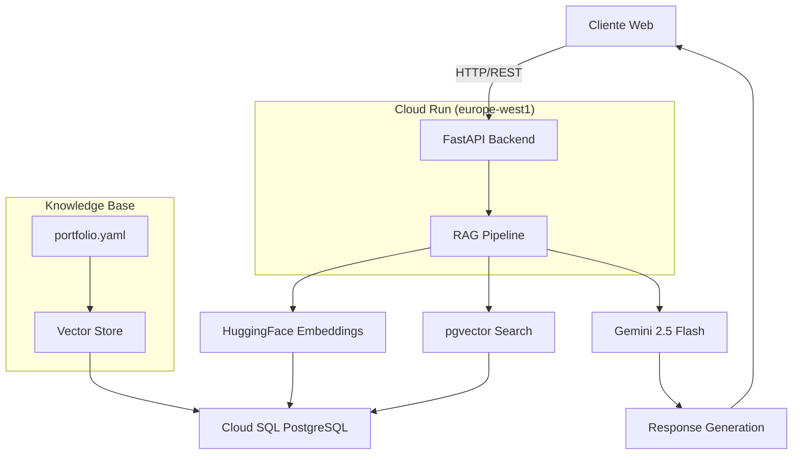

# 🤖 AI Resume Agent

Chatbot RAG (Retrieval Augmented Generation) para portfolio profesional. Responde preguntas sobre experiencia, habilidades y proyectos usando tecnologías **económicas** en la nube.

## 🎯 Problema vs Solución

### **Problema**
- Los portfolios estáticos no permiten interacción dinámica con los visitantes
- Los reclutadores necesitan hacer preguntas específicas sobre experiencia y proyectos
- Falta de engagement y personalización en la presentación profesional

### **Solución**
- **Chatbot inteligente** que responde preguntas sobre experiencia profesional
- **RAG avanzado** con embeddings locales y búsqueda semántica
- **Bajo costo** usando free tiers y servicios económicos de Google Cloud
- **Ultra rápido** con respuestas en 1-2 segundos

## 🏗️ Arquitectura



## 🚀 Quick Start

### Prerrequisitos
- **Python 3.11**
- Cuenta de Google Cloud Platform
- Cuenta de Google con Gemini API habilitada

### 1. Setup de Infraestructura
```bash
# Clonar y configurar
git clone https://github.com/tu-usuario/ai-resume-agent.git
cd ai-resume-agent

# Autenticar en GCP
gcloud auth login
gcloud config set project YOUR_PROJECT_ID

# Setup automático
chmod +x scripts/setup/setup-gcp.sh
./scripts/setup/setup-gcp.sh
```

### 2. Configurar Variables de Entorno
```bash
# Editar .env
nano .env

# Agregar:
GEMINI_API_KEY=AI...  # Obtener en aistudio.google.com/app/apikey
```

### 3. Inicializar Vector Store
```bash
# Crear entorno virtual
python3.11 -m venv venv
source venv/bin/activate

# Instalar dependencias
pip install -r requirements.txt

# Procesar portfolio y cargar a pgvector
python scripts/setup/initialize_vector_store.py
```

### 4. Deploy Automático
```bash
# Push automático → Cloud Build → Deploy
git add .
git commit -m "feat: initial deployment"
git push origin main
```

### 5. Probar el Chatbot
```bash
# Obtener URL del servicio
gcloud run services describe chatbot-api --region europe-west1 --format 'value(status.url)'

# Test con curl
curl -X POST https://your-url/api/v1/chat \
  -H "Content-Type: application/json" \
  -H "Authorization: Bearer $(gcloud auth print-identity-token)" \
  -d '{"message":"¿Cuál es tu experiencia profesional?"}'
```

## 📁 Estructura del Proyecto

```
ai-resume-agent/
├── app/                          # Backend FastAPI
│   ├── main.py                  # Aplicación principal
│   ├── core/
│   │   ├── config.py            # Configuración centralizada
│   │   └── secrets.py           # Gestión de secretos
│   ├── services/
│   │   ├── rag_service.py       # Servicio RAG principal
│   │   ├── analytics_service.py # Analytics y métricas
│   │   └── flow_controller.py   # Control de flujo conversacional
│   ├── api/v1/endpoints/
│   │   ├── chat.py              # Endpoint /chat
│   │   └── analytics.py         # Endpoint /analytics
│   ├── models/                  # Modelos de base de datos
│   └── schemas/                 # Modelos Pydantic
│
├── scripts/                      # Scripts organizados
│   ├── setup/                   # 🔧 Configuración inicial
│   │   ├── setup-gcp.sh         # Setup completo de GCP
│   │   ├── initialize_vector_store.py  # Indexar portfolio
│   │   └── start-local.sh       # Desarrollo local
│   └── dev/                     # 🛠️ Desarrollo y debugging
│       └── query_vectors.sh     # Explorar vector store
│
├── data/
│   └── portfolio.yaml           # Knowledge base principal
│
├── tests/                       # Tests unitarios
├── docs/                        # Documentación técnica
├── Dockerfile                   # Imagen Docker optimizada
├── cloudbuild.yaml             # CI/CD con Cloud Build
├── requirements.txt             # Dependencias Python
└── README.md                   # Este archivo
```

## 🔧 Desarrollo Local

```bash
# Método rápido
./scripts/setup/start-local.sh

# En otro terminal
python3 -m http.server 3000
# Abrir: http://localhost:3000/test-local.html
```

## 📝 API Endpoints

### Swagger UI
- **URL**: `https://your-url/docs`
- **Autenticación**: Bearer token requerido

### POST /api/v1/chat
Enviar mensaje al chatbot

**Request:**
```json
{
  "message": "¿Cuál es tu experiencia con Python?",
  "session_id": "optional-session-id",
  "user_type": "IT"
}
```

**Response:**
```json
{
  "message": "Tengo más de 10 años de experiencia con Python...",
  "sources": [
    {
      "type": "experience",
      "content_preview": "Empresa: InAdvance...",
      "metadata": {...}
    }
  ],
  "session_id": "...",
  "timestamp": "2025-01-15T10:30:00",
  "model": "gemini-2.5-flash"
}
```

### GET /api/v1/health
Health check del servicio

**Response:**
```json
{
  "status": "healthy",
  "version": "1.0.0",
  "timestamp": "2025-01-15T10:30:00"
}
```

### GET /api/v1/analytics
Métricas y analytics del chatbot

**Response:**
```json
{
  "total_sessions": 150,
  "total_messages": 450,
  "avg_session_duration": "5m 30s",
  "top_questions": [...],
  "user_types": {...}
}
```

## 🧪 Testing

```bash
# Tests unitarios
pytest tests/

# Test manual del RAG
python -c "
from app.services.rag_service import RAGService
import asyncio

async def test():
    service = RAGService()
    result = await service.generate_response('¿Cuál es tu experiencia?')
    print(result)

asyncio.run(test())
"
```

## 🔒 Seguridad

- ✅ **CORS** configurado para dominios específicos
- ✅ **Rate limiting** en endpoints
- ✅ **Validación** de inputs con Pydantic
- ✅ **Secrets** en Google Secret Manager
- ✅ **Usuario no-root** en Docker
- ✅ **Logs seguros** (sin información sensible)

## 🎨 Personalización

### Modificar el System Prompt
Editar `app/services/rag_service.py`:
```python
def _create_system_prompt(self) -> PromptTemplate:
    template = """Tu prompt personalizado aquí..."""
    ...
```

### Actualizar Portfolio
```bash
# 1. Editar tu portfolio
nano data/portfolio.yaml

# 2. Re-indexar vectores
python scripts/setup/initialize_vector_store.py

# 3. Re-deploy automático
git add . && git commit -m "update portfolio" && git push
```

## 📚 Tech Stack

### Backend & AI
- **Framework**: FastAPI 0.115+ (Python 3.11)
- **LLM**: Gemini 2.5 Flash (~1-2s respuesta)
- **Embeddings**: HuggingFace sentence-transformers (all-MiniLM-L6-v2, 384-dim, local)
- **Vector DB**: pgvector 0.5+ en PostgreSQL 15 (Cloud SQL)
- **RAG Framework**: LangChain 0.3+

### Infrastructure (GCP)
- **Compute**: Cloud Run (1GB RAM, 1 vCPU, europe-west1)
- **Database**: Cloud SQL (PostgreSQL + pgvector, f1-micro)
- **Registry**: Artifact Registry (europe-west1)
- **Build**: Cloud Build (CI/CD automático)

### Development
- **Containerization**: Docker (multi-stage build)
- **Testing**: pytest
- **CI/CD**: Cloud Build con triggers automáticos

## ⚡ Performance

```
Latencia típica: ~1.5-2 segundos (end-to-end)
  - Embedding query: ~50ms (local)
  - Vector search: ~20ms (pgvector)
  - LLM generation: ~1-2s (Gemini)
  - Total: ~1.5-2s ✅

Throughput: 30-50 requests/minuto
Vector store: 70 chunks, 384-dim embeddings
```

## 📄 Licencia

Este proyecto está bajo la licencia MIT. Ver `LICENSE` para más detalles.

## 👤 Autor

**Álvaro Maldonado**
- Website: https://almapi.dev
- LinkedIn: https://linkedin.com/in/almapidev
- Email: readme.md@almapi.dev

---

**Made with ❤️ using AI**
