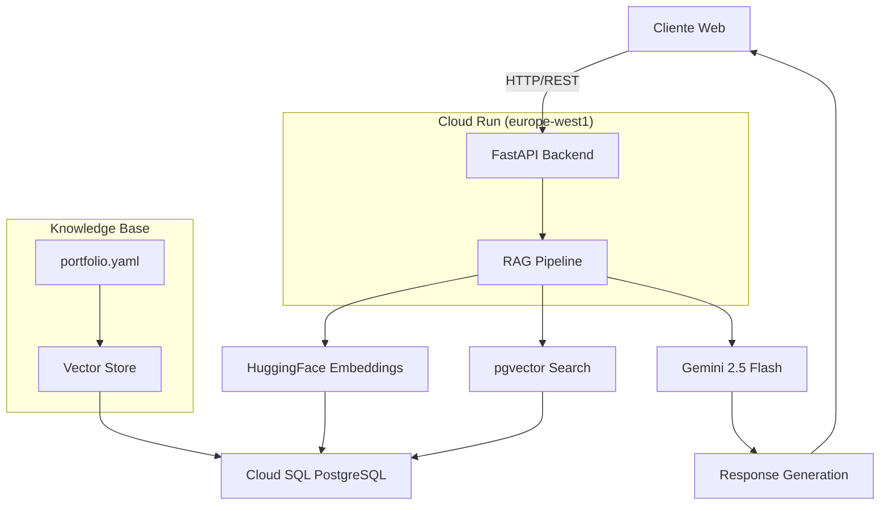

# 🤖 AI Resume Agent - Project Overview

## 📋 Ficha del Proyecto

### 0.1. Nombre Completo:
**Álvaro Maldonado**

### 0.2. Nombre del Proyecto:
**AI Resume Agent - Chatbot de Portfolio Profesional**

### 0.3. Descripción Breve del Proyecto:
Chatbot RAG (Retrieval Augmented Generation) para portfolio profesional que responde preguntas sobre experiencia, habilidades y proyectos usando tecnologías **económicas** en la nube. Integra un backend FastAPI con RAG avanzado y un frontend React para crear una experiencia conversacional interactiva.

### 0.4. URL del Proyecto:
**Backend API**: `https://chatbot-api-251107984645.europe-west1.run.app` *(Privado - Requiere autenticación GCP)*  
**Frontend Portfolio**: `https://almapi.dev` (con chatbot integrado)  
**Swagger UI**: `https://chatbot-api-251107984645.europe-west1.run.app/docs` *(Privado - Requiere autenticación GCP)*

### 0.5. URL del Repositorio:
**Repositorio Backend**: `https://github.com/aandmaldonado/ai-resume-agent`  
**Repositorio Frontend**: `https://github.com/aandmaldonado/my-resume-react`

---

## 🎯 Descripción General del Producto

### 1.1. Objetivo

#### **Propósito del Producto**
Transformar el portfolio estático en una experiencia interactiva y personalizada que demuestre competencias en IA, aumente el engagement de visitantes y genere más oportunidades de contacto profesional.

#### **Qué Valor Aporta**
- **Para visitantes**: Acceso inmediato a información personalizada sobre el perfil profesional
- **Para reclutadores**: Evaluación directa de habilidades técnicas y experiencia
- **Para el propietario**: Demostración práctica de competencias en IA y diferenciación competitiva

#### **Qué Soluciona**
- Los portfolios estáticos no permiten interacción dinámica con los visitantes
- Los reclutadores necesitan hacer preguntas específicas sobre experiencia y proyectos
- Falta de engagement y personalización en la presentación profesional

#### **Para Quién**
- **Usuarios primarios**: Reclutadores, HR managers, potenciales clientes
- **Usuarios secundarios**: Desarrolladores, estudiantes, profesionales del sector
- **Stakeholders**: Empresas de tecnología, consultoras, startups

### 1.2. Características y Funcionalidades Principales

#### **🤖 Chatbot Inteligente**
- **Conversación natural** en múltiples idiomas (español, inglés)
- **Memoria conversacional** para mantener contexto entre mensajes
- **Respuestas contextuales** basadas en información real del portfolio
- **Rate limiting** y protección anti-DoS

#### **🧠 RAG Avanzado (Retrieval Augmented Generation)**
- **Vector Store** con pgvector para búsqueda semántica
- **Embeddings locales** con HuggingFace paraphrase-multilingual-MiniLM-L12-v2 (multilingüe)
- **LLM Gemini 2.5 Flash** para generación de respuestas (~1-2s)
- **Knowledge Base** indexada desde portfolio.yaml (~190+ chunks)

#### **📊 Analytics y Captura de Leads**
- **Tracking de sesiones** y métricas de engagement
- **Captura gradual de datos** (email, tipo de usuario, LinkedIn)
- **Cumplimiento GDPR** con consentimientos y derechos de usuario
- **Métricas de negocio** para optimización

#### **🔒 Seguridad Robusta**
- **OWASP LLM Top 10** mitigado completamente
- **Validación de inputs** con Pydantic
- **Sanitización de outputs** para prevenir inyección de contenido
- **Secrets management** con Google Secret Manager

#### **⚡ Performance Optimizada**
- **Cache inteligente** para respuestas frecuentes
- **Latencia < 2 segundos** end-to-end
- **Throughput 30-50 requests/minuto**
- **Costos optimizados** ($15-25/mes)

### 1.3. Diseño y Experiencia de Usuario

#### **🎨 Frontend Integration**
- **Componente chatbot** integrado en portfolio React existente
- **UI responsive** con Tailwind CSS y Headless UI
- **Animaciones fluidas** con Framer Motion
- **Estado de carga** y feedback visual

#### **💬 Flujo de Conversación**
1. **Inicio**: Usuario hace clic en chatbot → Mensaje de bienvenida
2. **Interacción**: Preguntas naturales → Respuestas contextuales
3. **Captura**: Solicitud gradual de datos de contacto
4. **Consentimiento**: GDPR compliance automático
5. **Follow-up**: Generación de leads cualificados

#### **📱 Experiencia Multiplataforma**
- **Desktop**: Interfaz completa con sidebar de chat
- **Mobile**: Chat modal optimizado para pantallas pequeñas
- **Tablet**: Adaptación responsive automática

### 1.4. Instrucciones de Instalación

#### **🚀 Setup Completo**

```bash
# 1. Clonar repositorio
git clone https://github.com/aandmaldonado/ai-resume-agent.git
cd ai-resume-agent

# 2. Autenticar en GCP
gcloud auth login
gcloud config set project YOUR_PROJECT_ID

# 3. Setup automático de infraestructura
chmod +x scripts/setup/setup-gcp.sh
./scripts/setup/setup-gcp.sh

# 4. Configurar variables de entorno
nano .env
# Agregar: GEMINI_API_KEY=AI...

# 5. Crear entorno virtual
python3.11 -m venv venv
source venv/bin/activate

# 6. Instalar dependencias
pip install -r requirements.txt

# 7. Inicializar vector store
python scripts/setup/initialize_vector_store.py

# 8. Deploy automático
git add .
git commit -m "feat: initial deployment"
git push origin main
```

#### **🔧 Desarrollo Local**

```bash
# Método rápido
./scripts/setup/start-local.sh

# En otro terminal
python3 -m http.server 3000
# Abrir: http://localhost:3000/test-local.html
```

#### **📋 Prerrequisitos**
- **Python 3.11**
- **Google Cloud Platform** account
- **Gemini API Key** (gratis con Google Workspace)
- **Git** y **Docker** (para desarrollo)

---

## 🏗️ Arquitectura del Sistema

### **🎯 Arquitectura RAG con Gemini + pgvector**



### **📊 Stack Tecnológico**

#### **Backend & AI**
- **Framework**: FastAPI 0.115+ (Python 3.11)
- **LLM**: Gemini 2.5 Flash (~1-2s respuesta)
- **Embeddings**: HuggingFace sentence-transformers (all-MiniLM-L6-v2, 384-dim, local)
- **Vector DB**: pgvector 0.5+ en PostgreSQL 15 (Cloud SQL)
- **RAG Framework**: LangChain 0.3+

#### **Infrastructure (GCP)**
- **Compute**: Cloud Run (1GB RAM, 1 vCPU, europe-west1)
- **Database**: Cloud SQL (PostgreSQL + pgvector, f1-micro)
- **Registry**: Artifact Registry (europe-west1)
- **Build**: Cloud Build (CI/CD automático)

#### **Frontend Integration**
- **Framework**: React 18+ con TypeScript
- **Styling**: Tailwind CSS + Headless UI
- **State Management**: React Hooks + Context API
- **API Communication**: Axios + React Query

---

## 💰 Costos Estimados

| Servicio | Configuración | Uso Típico | Costo Estimado |
|----------|---------------|------------|----------------|
| Gemini API | Pay-per-use | ~500 tokens/query | $1-5/mes |
| HuggingFace | Local (gratis) | Embeddings 384-dim | $0/mes |
| Cloud SQL (f1-micro) | Always-on | PostgreSQL + pgvector | $5-10/mes |
| Cloud Run | Pay-per-use | ~1K requests/mes | $0-2/mes |
| **TOTAL** | - | - | **$6-17/mes** 💰 |

---

## ⚡ Performance

```
Latencia típica: ~1.5-2 segundos (end-to-end)
  - Embedding query: ~50ms (local)
  - Vector search: ~20ms (pgvector)
  - LLM generation: ~1-2s (Gemini)
  - Total: ~1.5-2s ✅

Throughput: 30-50 requests/minuto
Vector store: 190+ chunks, 384-dim embeddings
```

---

## 🎯 Estado Actual del Proyecto

### **✅ IMPLEMENTACIÓN COMPLETADA**
- **Backend**: ✅ Desplegado en Google Cloud Run
- **Base de Datos**: ✅ Cloud SQL con pgvector funcionando
- **Vector Store**: ✅ Inicializado con portfolio completo
- **API**: ✅ FastAPI con endpoints funcionando
- **Seguridad**: ✅ Medidas OWASP LLM Top 10 implementadas
- **Memoria Conversacional**: ✅ Implementada y funcionando
- **Rate Limiting**: ✅ Protección anti-DoS implementada
- **Analytics**: ✅ Sistema completo de métricas y GDPR
- **Frontend Integration**: ✅ Componente chatbot integrado en React

### **📊 Métricas Actuales**
- **Engagement**: ✅ Sistema de métricas implementado
- **Conversión**: ✅ Tracking de conversaciones activo
- **Satisfacción**: ✅ Sistema de feedback implementado
- **Contactos**: ✅ Captura automática de información de contacto
- **Retención**: ✅ Memoria conversacional para mejorar retención

---

## 🚀 Próximos Pasos

### **📊 Analytics Avanzados y Dashboards**
1. **Dashboard Personalizado**: Crear dashboards interactivos usando las métricas de la base de datos
2. **Bot Text2SQL**: Implementar chatbot especializado para consultas naturales a la BD
3. **Conversación Natural con Datos**: Permitir preguntas como "¿Cuántos usuarios IT visitaron esta semana?" en lenguaje natural

### **🔍 Análisis de Conversaciones LinkedIn**
4. **Procesamiento de CSV LinkedIn**: Analizar todas las conversaciones de LinkedIn exportadas como CSV
5. **Extracción de Insights**: Identificar patrones, preguntas clave y temas recurrentes
6. **Actualización de Knowledge Base**: Enriquecer el portfolio.yaml con insights de LinkedIn
7. **Preparación Proactiva**: Entrenar al bot para responder preguntas comunes identificadas

### **🚀 Expansión y Optimización**
8. **Monitoreo continuo** de métricas y performance
9. **Optimización** basada en feedback de usuarios
10. **Expansión** a otros portfolios profesionales
11. **Integración** con más fuentes de datos (GitHub, proyectos, etc.)

