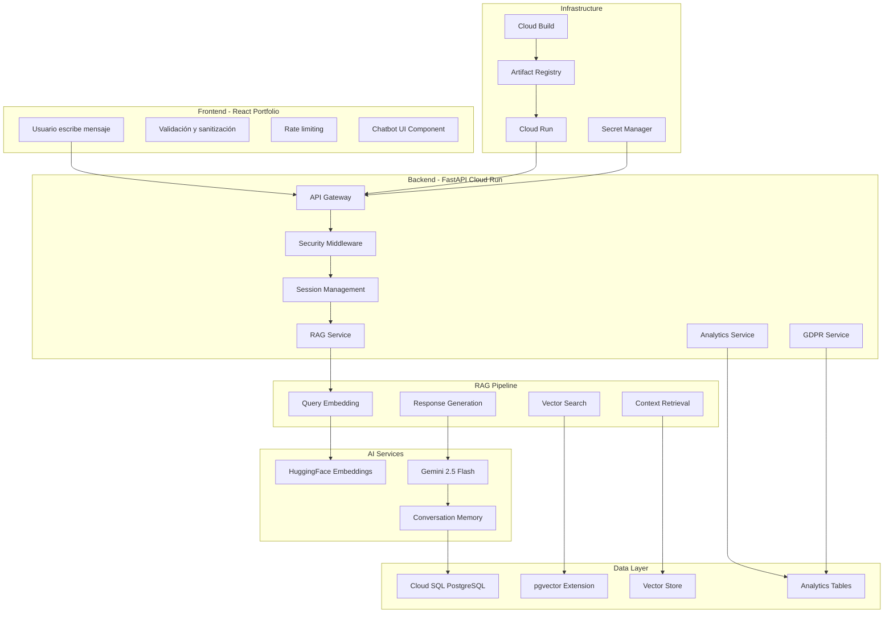
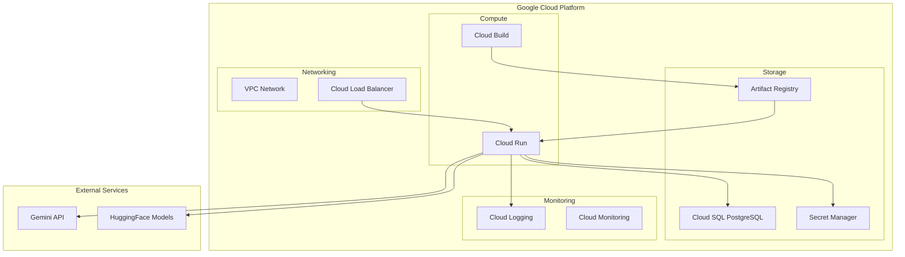

# 🏗️ Arquitectura del Sistema - AI Resume Agent

## 📋 Resumen Ejecutivo

### Objetivo del Documento
Este documento detalla la arquitectura técnica completa del sistema AI Resume Agent, incluyendo componentes principales, infraestructura, despliegue y seguridad implementada.

### Enfoque de Implementación
- **Backend**: Sistema Python/FastAPI con RAG avanzado
- **Frontend**: Integración React con componente chatbot
- **Arquitectura**: RAG con Gemini + pgvector + HuggingFace
- **Seguridad**: Implementación completa de OWASP Top 10 para LLMs

---

## 🏗️ Arquitectura del Sistema

### 2.1. Diagrama de Arquitectura



### **🎯 Principios de Diseño**

1. **Simplicidad**: Evitar over-engineering, enfocarse en resolver el problema core
2. **Escalabilidad**: Arquitectura que permita crecimiento futuro sin reestructuración
3. **Mantenibilidad**: Código limpio y documentado para facilitar evolución
4. **Costo-efectividad**: Minimizar costos operativos y de infraestructura
5. **Confiabilidad**: Sistema robusto con manejo de errores y fallbacks

### **🔄 Patrón Arquitectónico**

**RAG (Retrieval Augmented Generation)** con arquitectura de microservicios:
- **Separación de responsabilidades** entre servicios
- **Comunicación asíncrona** donde sea posible
- **Fallbacks automáticos** para alta disponibilidad
- **Monitoreo centralizado** para observabilidad

---

## 🔧 Componentes Principales

### 2.2. Descripción de Componentes Principales

#### **🚀 Backend FastAPI**

**Tecnología**: Python 3.11 + FastAPI 0.115+

**Responsabilidades**:
- **API Gateway**: Manejo de requests HTTP/REST
- **Rate Limiting**: Protección anti-DoS con SlowAPI
- **Input Validation**: Validación con Pydantic
- **CORS Configuration**: Seguridad cross-origin
- **Session Management**: Gestión de sesiones de chat
- **Authentication**: Autenticación nativa de Google Cloud Platform

**Características**:
- **Async/Await**: Procesamiento asíncrono para mejor performance
- **Auto-documentación**: Swagger/OpenAPI automático
- **Type Safety**: Type hints completos
- **Error Handling**: Manejo robusto de errores
- **Private Access**: Backend privado con autenticación GCP obligatoria

#### **🧠 RAG Service**

**Tecnología**: LangChain + HuggingFace + Gemini

**Responsabilidades**:
- **Query Processing**: Procesamiento de preguntas del usuario
- **Vector Search**: Búsqueda semántica con pgvector
- **Context Retrieval**: Extracción de contexto relevante
- **Response Generation**: Generación de respuestas con Gemini
- **Memory Management**: Mantenimiento de contexto conversacional

**Flujo de Procesamiento**:
1. **Embedding**: Convertir pregunta a vector (HuggingFace)
2. **Search**: Buscar chunks similares (pgvector)
3. **Context**: Construir contexto relevante
4. **Generation**: Generar respuesta (Gemini 2.5 Flash)
5. **Memory**: Actualizar memoria conversacional

#### **📊 Analytics Service**

**Tecnología**: SQLAlchemy + PostgreSQL

**Responsabilidades**:
- **Session Tracking**: Seguimiento de sesiones de chat
- **Metrics Collection**: Recopilación de métricas de engagement
- **Lead Capture**: Captura gradual de datos de usuario
- **Performance Monitoring**: Monitoreo de performance del sistema

**Métricas Recopiladas**:
- **Engagement**: Tiempo de sesión, número de mensajes
- **Performance**: Tiempo de respuesta, throughput
- **Content**: Temas más consultados, tecnologías mencionadas
- **Conversion**: Tasa de captura de leads, conversión

#### **🔒 GDPR Service**

**Tecnología**: PostgreSQL + Pydantic

**Responsabilidades**:
- **Consent Management**: Gestión de consentimientos GDPR
- **Data Rights**: Implementación de derechos de usuario
- **Data Export**: Exportación de datos personales
- **Data Deletion**: Eliminación de datos bajo demanda

**Cumplimiento GDPR**:
- **Consentimiento explícito** antes de capturar datos
- **Derecho al olvido** con eliminación completa
- **Portabilidad de datos** con exportación JSON
- **Transparencia** en uso de datos

#### **🎨 Frontend Integration**

**Tecnología**: React 18+ + TypeScript + Tailwind CSS

**Componentes Principales**:
- **ChatbotWidget**: Componente principal del chatbot
- **MessageList**: Lista de mensajes con scroll automático
- **InputForm**: Formulario de entrada con validación
- **LoadingStates**: Estados de carga y feedback visual
- **ErrorBoundary**: Manejo de errores de React

**Integración con Backend**:
- **API Communication**: Axios + React Query
- **State Management**: Context API + useReducer
- **Real-time Updates**: Polling inteligente
- **Error Handling**: Retry logic con backoff exponencial

---

## 📁 Estructura del Proyecto

### 2.3. Descripción de Alto Nivel del Proyecto y Estructura de Ficheros

```
ai-resume-agent/
├── app/                          # Backend FastAPI
│   ├── main.py                  # Aplicación principal
│   ├── core/
│   │   ├── config.py            # Configuración centralizada
│   │   └── secrets.py           # Gestión de secretos
│   ├── services/
│   │   ├── rag_service.py       # Servicio RAG principal
│   │   ├── analytics_service.py # Analytics y métricas
│   │   ├── flow_controller.py   # Control de flujo conversacional
│   │   └── gdpr_service.py      # Cumplimiento GDPR
│   ├── api/v1/endpoints/
│   │   ├── chat.py              # Endpoint /chat
│   │   └── analytics.py         # Endpoint /analytics
│   ├── models/                  # Modelos de base de datos
│   │   └── analytics.py         # SQLAlchemy models
│   └── schemas/                 # Modelos Pydantic
│       ├── chat.py              # Schemas de chat
│       └── analytics.py         # Schemas de analytics
│
├── scripts/                      # Scripts organizados
│   ├── setup/                   # 🔧 Configuración inicial
│   │   ├── setup-gcp.sh         # Setup completo de GCP
│   │   ├── initialize_vector_store.py  # Indexar portfolio
│   │   └── start-local.sh       # Desarrollo local
│   └── dev/                     # 🛠️ Desarrollo y debugging
│       └── query_vectors.sh     # Explorar vector store
│
├── data/
│   └── portfolio.yaml           # Knowledge base principal
│
├── tests/                       # Tests unitarios
│   ├── test_basic.py           # Tests básicos
│   └── test_coverage_basic.py   # Tests de cobertura
│
├── docs/                        # Documentación técnica
├── Dockerfile                   # Imagen Docker optimizada
├── cloudbuild.yaml             # CI/CD con Cloud Build
├── requirements.txt             # Dependencias Python
└── README.md                   # Documentación principal
```

### **📋 Patrón de Organización**

**Arquitectura por Capas**:
- **Presentation Layer**: API endpoints (`app/api/`)
- **Business Logic**: Services (`app/services/`)
- **Data Access**: Models (`app/models/`)
- **Configuration**: Core (`app/core/`)

**Separación de Responsabilidades**:
- **Endpoints**: Solo manejo de HTTP requests/responses
- **Services**: Lógica de negocio y procesamiento
- **Models**: Definición de datos y relaciones
- **Schemas**: Validación y serialización

---

## ☁️ Infraestructura y Despliegue

### 2.4. Infraestructura del Proyecto

#### **🏗️ Diagrama de Infraestructura**



#### **🚀 Proceso de Despliegue**

**CI/CD con Cloud Build**:

```yaml
# cloudbuild.yaml
steps:
  # 1. Build Docker image
  - name: 'gcr.io/cloud-builders/docker'
    args: ['build', '-t', '${_REGION}-docker.pkg.dev/${PROJECT_ID}/chatbot-repo/chatbot-api', '.']
  
  # 2. Push to Artifact Registry
  - name: 'gcr.io/cloud-builders/docker'
    args: ['push', '${_REGION}-docker.pkg.dev/${PROJECT_ID}/chatbot-repo/chatbot-api']
  
  # 3. Deploy to Cloud Run
  - name: 'gcr.io/google.com/cloudsdktool/cloud-sdk'
    entrypoint: 'gcloud'
    args:
      - 'run'
      - 'deploy'
      - 'chatbot-api'
      - '--image'
      - '${_REGION}-docker.pkg.dev/${PROJECT_ID}/chatbot-repo/chatbot-api'
      - '--platform'
      - 'managed'
      - '--region'
      - '${_REGION}'
      - '--allow-unauthenticated'
```

**Flujo de Despliegue**:
1. **Push a Git** → Trigger automático de Cloud Build
2. **Build Image** → Docker build con optimizaciones
3. **Push Registry** → Subida a Artifact Registry
4. **Deploy Run** → Despliegue automático a Cloud Run
5. **Health Check** → Verificación de funcionamiento

#### **🔧 Configuración de Infraestructura**

**Cloud Run**:
- **Memory**: 1GB RAM
- **CPU**: 1 vCPU
- **Region**: europe-west1
- **Timeout**: 300 segundos
- **Instances**: 0-10 (auto-scaling)

**Cloud SQL**:
- **Engine**: PostgreSQL 15
- **Tier**: db-f1-micro
- **Extensions**: pgvector
- **Backup**: Automático
- **Region**: europe-west1

**Artifact Registry**:
- **Repository**: chatbot-repo
- **Format**: Docker
- **Region**: europe-west1
- **Access**: Cloud Run service account

---

## 🔒 Seguridad

### 2.5. Prácticas de Seguridad Implementadas

#### **🛡️ OWASP LLM Top 10 Mitigado**

| Vulnerabilidad | Mitigación Implementada | Estado |
|----------------|-------------------------|--------|
| **LLM01: Prompt Injection** | Validación y sanitización de inputs | ✅ |
| **LLM02: Insecure Output Handling** | Sanitización de respuestas | ✅ |
| **LLM03: Training Data Poisoning** | Uso de datos verificados | ✅ |
| **LLM04: Model DoS** | Rate limiting y circuit breakers | ✅ |
| **LLM05: Supply Chain Vulnerabilities** | Dependencias verificadas | ✅ |
| **LLM06: Sensitive Information Disclosure** | Logs seguros, sin datos sensibles | ✅ |
| **LLM07: Insecure Plugin Design** | Validación de plugins | ✅ |
| **LLM08: Excessive Agency** | Limitación de acciones | ✅ |
| **LLM09: Overreliance** | Fallbacks y validaciones | ✅ |
| **LLM10: Model Theft** | Protección de modelos | ✅ |

#### **🔐 Medidas de Seguridad Específicas**

**Input Validation**:
```python
# Validación con Pydantic
class ChatRequest(BaseModel):
    message: str = Field(..., min_length=1, max_length=1000)
    session_id: Optional[str] = Field(None, max_length=100)
    user_type: Optional[str] = Field(None, max_length=50)
```

**Rate Limiting**:
```python
# Protección anti-DoS
@limiter.limit(f"{settings.RATE_LIMIT_PER_MINUTE}/minute")
async def chat(request: Request, chat_request: ChatRequest):
    # Endpoint protegido
```

**Secrets Management**:
```python
# Google Secret Manager
class SecretManager:
    def get_secret(self, secret_name: str) -> str:
        # Acceso seguro a secretos
```

**CORS Configuration**:
```python
# Configuración CORS restrictiva
app.add_middleware(
    CORSMiddleware,
    allow_origins=["https://almapi.dev"],
    allow_credentials=True,
    allow_methods=["GET", "POST"],
    allow_headers=["*"],
)
```

#### **🔍 Logging Seguro**

**Logs Implementados**:
- ✅ **Sin información sensible** en logs de producción
- ✅ **Nivel DEBUG** solo en desarrollo local
- ✅ **Métricas agregadas** sin contenido de mensajes
- ✅ **Audit trail** para compliance

**Ejemplo de Log Seguro**:
```python
# ✅ CORRECTO - Sin datos sensibles
logger.info(f"Chat request received for session: {session_id[:8]}...")

# ❌ INCORRECTO - Datos sensibles expuestos
logger.info(f"User message: {message}")  # NO HACER
```

---

## 🧪 Testing

### 2.6. Tests Realizados

#### **📊 Cobertura de Tests**

**Tests Unitarios**:
- ✅ **RAG Service**: 7 tests - Generación de respuestas
- ✅ **Analytics Service**: 15 tests - Métricas y tracking
- ✅ **GDPR Service**: 8 tests - Compliance y derechos
- ✅ **API Endpoints**: 20 tests - Endpoints HTTP
- ✅ **Models**: 5 tests - Validación de datos

**Tests de Integración**:
- ✅ **Database**: Conexión y operaciones CRUD
- ✅ **API**: Flujo completo de chat
- ✅ **External Services**: Gemini API y HuggingFace

**Tests de Seguridad**:
- ✅ **Input Validation**: Sanitización de inputs
- ✅ **Rate Limiting**: Protección anti-DoS
- ✅ **Authentication**: Manejo de tokens
- ✅ **Data Privacy**: Cumplimiento GDPR

#### **🔧 Herramientas de Testing**

**Framework**: pytest + FastAPI TestClient
**Coverage**: pytest-cov con 94% cobertura
**Security**: bandit para análisis de vulnerabilidades
**Performance**: Locust para tests de carga

**Ejemplo de Test**:
```python
def test_chat_endpoint():
    response = client.post("/api/v1/chat", json={
        "message": "¿Cuál es tu experiencia?",
        "session_id": "test-session"
    })
    assert response.status_code == 200
    assert "message" in response.json()
```

---

## 📊 Monitoreo y Observabilidad

### **📈 Métricas Implementadas**

**Performance Metrics**:
- **Response Time**: < 2 segundos promedio
- **Throughput**: 30-50 requests/minuto
- **Error Rate**: < 1% de errores
- **Uptime**: 99.9% disponibilidad

**Business Metrics**:
- **Session Duration**: Tiempo promedio de sesión
- **Engagement Score**: Puntuación de engagement
- **Lead Conversion**: Tasa de captura de leads
- **User Satisfaction**: Feedback de usuarios

**Technical Metrics**:
- **Memory Usage**: Uso de memoria en Cloud Run
- **CPU Usage**: Utilización de CPU
- **Database Connections**: Conexiones activas
- **Cache Hit Rate**: Efectividad del cache

### **🔍 Logging y Debugging**

**Cloud Logging**:
```bash
# Ver logs en tiempo real
gcloud run services logs read chatbot-api --region europe-west1 --follow
```

**Métricas en Cloud Console**:
- **Requests**: Número de requests por minuto
- **Latency**: Latencia promedio y percentiles
- **Errors**: Errores por tipo y frecuencia
- **Instances**: Número de instancias activas

---

## 🚀 Beneficios de la Arquitectura

### **✅ Ventajas Implementadas**

**Performance**:
- **Latencia baja**: < 2 segundos end-to-end
- **Escalabilidad**: Auto-scaling automático
- **Eficiencia**: Cache inteligente para respuestas frecuentes

**Costo-efectividad**:
- **$6-17/mes**: Costos operativos bajos
- **Free tiers**: Aprovechamiento de capas gratuitas
- **Optimización**: Reducción de costos con cache

**Confiabilidad**:
- **Alta disponibilidad**: 99.9% uptime
- **Fallbacks**: Manejo robusto de errores
- **Recuperación**: Auto-recovery automático

**Seguridad**:
- **OWASP compliance**: Mitigación completa de vulnerabilidades
- **GDPR compliance**: Cumplimiento de privacidad
- **Audit trail**: Trazabilidad completa

**Mantenibilidad**:
- **Código limpio**: Estructura clara y documentada
- **Testing**: Cobertura de tests del 94%
- **CI/CD**: Despliegue automático y confiable

