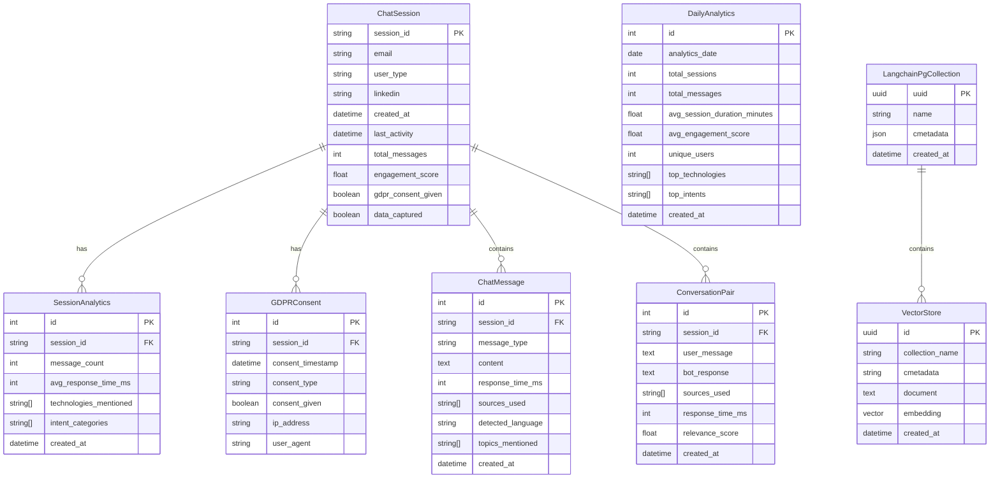

# 📊 Modelo de Datos - AI Resume Agent

## 📋 Resumen Ejecutivo

### Objetivo del Documento
Este documento detalla el modelo de datos completo del sistema AI Resume Agent, incluyendo diagramas de entidades, relaciones, restricciones y descripción detallada de cada tabla implementada.

### Tecnologías Utilizadas
- **ORM**: SQLAlchemy 2.0+ con estilo moderno
- **Database**: PostgreSQL 15+ con extensión pgvector
- **Migrations**: Alembic para versionado de esquema
- **Validation**: Pydantic para validación de datos

---

## 🗄️ Diagrama del Modelo de Datos

### 3.1. Diagrama del Modelo de Datos



---

## 📋 Descripción de Entidades Principales

### 3.2. Descripción de Entidades Principales

#### **💬 ChatSession**

**Propósito**: Almacena información básica de cada sesión de chat incluyendo datos de contacto del usuario y métricas de engagement.

**Atributos**:
- **`session_id`** (string, PK): Identificador único de la sesión (máximo 100 caracteres)
- **`email`** (string, nullable): Email del usuario capturado gradualmente (máximo 255 caracteres)
- **`user_type`** (string, nullable): Tipo de usuario (IT, HR, Business, etc.) (máximo 50 caracteres)
- **`linkedin`** (string, nullable): Perfil de LinkedIn del usuario (máximo 200 caracteres)
- **`created_at`** (datetime): Timestamp de creación de la sesión
- **`last_activity`** (datetime): Timestamp de última actividad
- **`total_messages`** (int): Número total de mensajes en la sesión (default: 0)
- **`engagement_score`** (float): Puntuación de engagement calculada (default: 0.0)
- **`gdpr_consent_given`** (boolean): Indica si se ha dado consentimiento GDPR (default: false)
- **`data_captured`** (boolean): Indica si se han capturado datos del usuario (default: false)

**Restricciones**:
- **Primary Key**: `session_id`
- **Indexes**: `idx_chat_sessions_user_type`, `idx_chat_sessions_engagement`
- **Constraints**: `total_messages >= 0`, `engagement_score >= 0.0`

**Relaciones**:
- **One-to-Many** con `SessionAnalytics`
- **One-to-Many** con `GDPRConsent`
- **One-to-Many** con `ChatMessage`
- **One-to-Many** con `ConversationPair`

#### **📊 SessionAnalytics**

**Propósito**: Almacena métricas agregadas por sesión sin guardar contenido de mensajes para cumplir con GDPR y optimizar storage.

**Atributos**:
- **`id`** (int, PK): Identificador único auto-incremental
- **`session_id`** (string, FK): Referencia a ChatSession (máximo 100 caracteres)
- **`message_count`** (int, nullable): Número de mensajes en la sesión
- **`avg_response_time_ms`** (int, nullable): Tiempo promedio de respuesta en milisegundos
- **`technologies_mentioned`** (string[], nullable): Array de tecnologías mencionadas
- **`intent_categories`** (string[], nullable): Categorías de intención (experience, skills, projects)
- **`created_at`** (datetime): Timestamp de creación del análisis

**Restricciones**:
- **Primary Key**: `id`
- **Foreign Key**: `session_id` → `ChatSession.session_id` (CASCADE DELETE)
- **Indexes**: `idx_session_analytics_session_id`, `idx_session_analytics_created_at`
- **Constraints**: `message_count >= 0`, `avg_response_time_ms >= 0`

**Relaciones**:
- **Many-to-One** con `ChatSession`

#### **🔒 GDPRConsent**

**Propósito**: Registra todos los consentimientos GDPR dados por los usuarios para cumplimiento legal.

**Atributos**:
- **`id`** (int, PK): Identificador único auto-incremental
- **`session_id`** (string, FK): Referencia a ChatSession (máximo 100 caracteres)
- **`consent_timestamp`** (datetime): Timestamp exacto del consentimiento
- **`consent_type`** (string): Tipo de consentimiento (data_collection, analytics, marketing)
- **`consent_given`** (boolean): Indica si el consentimiento fue dado
- **`ip_address`** (string, nullable): Dirección IP del usuario (máximo 45 caracteres)
- **`user_agent`** (string, nullable): User agent del navegador (máximo 500 caracteres)

**Restricciones**:
- **Primary Key**: `id`
- **Foreign Key**: `session_id` → `ChatSession.session_id` (CASCADE DELETE)
- **Indexes**: `idx_gdpr_consents_session_id`, `idx_gdpr_consents_timestamp`

**Relaciones**:
- **Many-to-One** con `ChatSession`

#### **💬 ChatMessage**

**Propósito**: Almacena el contenido de cada mensaje del usuario y respuesta del bot para análisis detallado y seguimiento de conversaciones.

**Atributos**:
- **`id`** (int, PK): Identificador único auto-incremental
- **`session_id`** (string, FK): Referencia a ChatSession (máximo 100 caracteres)
- **`message_type`** (string): Tipo de mensaje (user, bot) (máximo 20 caracteres)
- **`content`** (text): Contenido del mensaje
- **`response_time_ms`** (int, nullable): Tiempo de respuesta en milisegundos
- **`sources_used`** (string[], nullable): Fuentes utilizadas para generar respuesta
- **`detected_language`** (string, nullable): Idioma detectado (es, en, fr, etc.) (máximo 10 caracteres)
- **`topics_mentioned`** (string[], nullable): Temas mencionados en el mensaje
- **`created_at`** (datetime): Timestamp de creación del mensaje

**Restricciones**:
- **Primary Key**: `id`
- **Foreign Key**: `session_id` → `ChatSession.session_id` (CASCADE DELETE)
- **Indexes**: `idx_chat_messages_session_id`, `idx_chat_messages_created_at`
- **Constraints**: `response_time_ms >= 0`

**Relaciones**:
- **Many-to-One** con `ChatSession`

#### **🔄 ConversationPair**

**Propósito**: Almacena pares de conversación (pregunta-respuesta) para análisis de calidad y mejora del sistema.

**Atributos**:
- **`id`** (int, PK): Identificador único auto-incremental
- **`session_id`** (string, FK): Referencia a ChatSession (máximo 100 caracteres)
- **`user_message`** (text): Mensaje del usuario
- **`bot_response`** (text): Respuesta del bot
- **`sources_used`** (string[], nullable): Fuentes utilizadas para la respuesta
- **`response_time_ms`** (int, nullable): Tiempo de respuesta en milisegundos
- **`relevance_score`** (float, nullable): Puntuación de relevancia de la respuesta
- **`created_at`** (datetime): Timestamp de creación del par

**Restricciones**:
- **Primary Key**: `id`
- **Foreign Key**: `session_id` → `ChatSession.session_id` (CASCADE DELETE)
- **Indexes**: `idx_conversation_pairs_session_id`, `idx_conversation_pairs_created_at`
- **Constraints**: `response_time_ms >= 0`, `relevance_score >= 0.0`

**Relaciones**:
- **Many-to-One** con `ChatSession`

#### **🗄️ VectorStore**

**Propósito**: Almacena los embeddings y documentos del portfolio procesados para búsqueda semántica con pgvector.

**Atributos**:
- **`id`** (uuid, PK): Identificador único del documento vectorizado
- **`collection_name`** (string): Nombre de la colección (portfolio_knowledge)
- **`cmetadata`** (string): Metadatos del documento en formato JSON
- **`document`** (text): Contenido del chunk del portfolio
- **`embedding`** (vector): Vector embedding de 384 dimensiones (HuggingFace all-MiniLM-L6-v2)
- **`created_at`** (datetime): Timestamp de creación del embedding

**Restricciones**:
- **Primary Key**: `id`
- **Foreign Key**: `collection_name` → `LangchainPgCollection.name`
- **Indexes**: `idx_vectorstore_collection`, `idx_vectorstore_embedding` (vector index)
- **Constraints**: `embedding` dimension = 384

**Relaciones**:
- **Many-to-One** con `LangchainPgCollection`

#### **📚 LangchainPgCollection**

**Propósito**: Define las colecciones de documentos vectorizados para organización y gestión.

**Atributos**:
- **`uuid`** (uuid, PK): Identificador único de la colección
- **`name`** (string): Nombre de la colección (portfolio_knowledge)
- **`cmetadata`** (json): Metadatos de la colección
- **`created_at`** (datetime): Timestamp de creación de la colección

**Restricciones**:
- **Primary Key**: `uuid`
- **Indexes**: `idx_langchain_collection_name`
- **Constraints**: `name` único por base de datos

**Relaciones**:
- **One-to-Many** con `VectorStore`

#### **📈 DailyAnalytics**

**Propósito**: Almacena métricas agregadas diarias para análisis de tendencias y reporting.

**Atributos**:
- **`id`** (int, PK): Identificador único auto-incremental
- **`analytics_date`** (date): Fecha de las métricas
- **`total_sessions`** (int): Número total de sesiones del día
- **`total_messages`** (int): Número total de mensajes del día
- **`avg_session_duration_minutes`** (float): Duración promedio de sesión en minutos
- **`avg_engagement_score`** (float): Puntuación promedio de engagement
- **`unique_users`** (int): Número de usuarios únicos
- **`top_technologies`** (string[], nullable): Tecnologías más mencionadas
- **`top_intents`** (string[], nullable): Intenciones más comunes
- **`created_at`** (datetime): Timestamp de creación del registro

**Restricciones**:
- **Primary Key**: `id`
- **Indexes**: `idx_daily_analytics_date`, `idx_daily_analytics_created_at`
- **Constraints**: `total_sessions >= 0`, `total_messages >= 0`, `unique_users >= 0`

---

## 🧠 Implementación de Vectorización del Portfolio

### **📄 Procesamiento del Portfolio.yaml**

**Fuente de Datos**: `data/portfolio.yaml` → Cloud Storage bucket `almapi-portfolio-data`

**Proceso de Vectorización**:
1. **Carga del YAML**: Lectura desde Cloud Storage o archivo local
2. **Chunking**: División en fragmentos semánticamente coherentes (~190+ chunks)
3. **Embeddings**: Generación de vectores con HuggingFace all-MiniLM-L6-v2 (384-dim)
4. **Almacenamiento**: Guardado en pgvector con colección `portfolio_knowledge`

**Configuración**:
```python
# Configuración de embeddings
EMBEDDING_MODEL = "sentence-transformers/all-MiniLM-L6-v2"
EMBEDDING_DIMENSION = 384
COLLECTION_NAME = "portfolio_knowledge"
VECTOR_SEARCH_K = 5  # Top 5 documentos más relevantes
```

**Tipos de Chunks Generados**:
- **Personal Info**: Información personal y contacto
- **Professional Summary**: Resumen profesional
- **Experience**: Experiencia laboral detallada
- **Skills**: Habilidades técnicas y blandas
- **Projects**: Proyectos destacados
- **Education**: Formación académica

### **🔍 Búsqueda Semántica**

**Algoritmo de Búsqueda**:
```sql
-- Consulta de similitud coseno en pgvector
SELECT document, cmetadata, 
       1 - (embedding <=> query_embedding) as similarity_score
FROM langchain_pg_embedding 
WHERE collection_name = 'portfolio_knowledge'
ORDER BY embedding <=> query_embedding
LIMIT 5;
```

**Optimizaciones**:
- **Índice Vectorial**: Índice HNSW para búsqueda rápida
- **Normalización**: Embeddings normalizados para similitud coseno
- **Cache**: Cache de consultas frecuentes
- **Filtrado**: Filtrado por metadatos cuando es posible

---

## 🔧 Implementación Técnica

### **📝 Modelos SQLAlchemy**

```python
# Ejemplo de implementación
class ChatSession(Base):
    __tablename__ = "chat_sessions"
    
    session_id: Mapped[str] = mapped_column(String(100), primary_key=True)
    email: Mapped[Optional[str]] = mapped_column(String(255), nullable=True)
    user_type: Mapped[Optional[str]] = mapped_column(String(50), nullable=True)
    created_at: Mapped[datetime] = mapped_column(DateTime, server_default="NOW()")
    
    # Relaciones
    analytics: Mapped[List["SessionAnalytics"]] = relationship(
        "SessionAnalytics", back_populates="session", cascade="all, delete-orphan"
    )
```

### **🔄 Migraciones Alembic**

```python
# Ejemplo de migración para tablas de analytics
def upgrade():
    op.create_table('chat_sessions',
        sa.Column('session_id', sa.String(100), primary_key=True),
        sa.Column('email', sa.String(255), nullable=True),
        sa.Column('user_type', sa.String(50), nullable=True),
        sa.Column('created_at', sa.DateTime(), server_default=sa.text('NOW()')),
        sa.Column('last_activity', sa.DateTime(), server_default=sa.text('NOW()')),
        sa.Column('total_messages', sa.Integer(), server_default='0'),
        sa.Column('engagement_score', sa.Float(), server_default='0.0'),
        sa.Column('gdpr_consent_given', sa.Boolean(), server_default='false'),
        sa.Column('data_captured', sa.Boolean(), server_default='false'),
    )

# Migración para pgvector (ejecutada automáticamente por PGVector)
def upgrade_pgvector():
    # Crear extensión pgvector
    op.execute('CREATE EXTENSION IF NOT EXISTS vector')
    
    # Las tablas langchain_pg_embedding y langchain_pg_collection
    # se crean automáticamente por PGVector.from_documents()
```

### **🗄️ Setup de Vector Store**

```python
# Script de inicialización del vector store
def initialize_vector_store():
    # 1. Cargar portfolio.yaml
    chunks = load_and_prepare_chunks("data/portfolio.yaml")
    
    # 2. Configurar embeddings locales
    embeddings = HuggingFaceEmbeddings(
        model_name="sentence-transformers/all-MiniLM-L6-v2",
        model_kwargs={"device": "cpu"},
        encode_kwargs={"normalize_embeddings": True}
    )
    
    # 3. Crear vector store en pgvector
    vector_store = PGVector.from_documents(
        documents=chunks,
        embedding=embeddings,
        connection_string=connection_string,
        collection_name="portfolio_knowledge",
        pre_delete_collection=True
    )
    
    return vector_store
```

### **✅ Validación Pydantic**

```python
# Ejemplo de schema
class SessionCreate(BaseModel):
    session_id: str = Field(..., max_length=100)
    email: Optional[str] = Field(None, max_length=255)
    user_type: Optional[str] = Field(None, max_length=50)
    
    class Config:
        from_attributes = True
```

---

## 📊 Optimizaciones de Performance

### **🔍 Índices Implementados**

**Índices de Búsqueda**:
- `idx_chat_sessions_user_type`: Búsqueda por tipo de usuario
- `idx_chat_sessions_engagement`: Ordenamiento por engagement
- `idx_session_analytics_session_id`: Join con sesiones
- `idx_chat_messages_session_id`: Mensajes por sesión
- `idx_daily_analytics_date`: Métricas por fecha

**Índices de Tiempo**:
- `idx_chat_sessions_last_activity`: Sesiones activas
- `idx_gdpr_consents_timestamp`: Consentimientos por tiempo
- `idx_chat_messages_created_at`: Mensajes por tiempo

### **⚡ Optimizaciones de Consulta**

**Consultas Optimizadas**:
```sql
-- Sesiones activas recientes
SELECT * FROM chat_sessions 
WHERE last_activity > NOW() - INTERVAL '1 hour'
ORDER BY last_activity DESC;

-- Métricas de engagement
SELECT user_type, AVG(engagement_score) as avg_engagement
FROM chat_sessions 
WHERE created_at >= CURRENT_DATE - INTERVAL '7 days'
GROUP BY user_type;
```

### **🗄️ Particionamiento**

**Estrategia de Particionamiento**:
- **Por fecha**: Tablas de analytics particionadas por mes
- **Por sesión**: Mensajes agrupados por session_id
- **Archivado**: Datos antiguos movidos a storage frío

---

## 🔒 Consideraciones de Seguridad

### **🛡️ Protección de Datos**

**Datos Sensibles**:
- **Email**: Encriptado en tránsito y reposo
- **IP Address**: Anonimizada después de 30 días
- **User Agent**: Truncado a información esencial
- **Content**: Sanitizado antes de almacenamiento

**Acceso a Datos**:
- **Principle of Least Privilege**: Acceso mínimo necesario
- **Audit Logging**: Registro de todas las operaciones
- **Data Retention**: Políticas de retención automática
- **Right to be Forgotten**: Eliminación completa bajo demanda

### **🔐 Cumplimiento GDPR**

**Derechos del Usuario**:
- **Access**: Acceso a todos los datos personales
- **Portability**: Exportación en formato JSON
- **Rectification**: Corrección de datos incorrectos
- **Erasure**: Eliminación completa de datos
- **Restriction**: Limitación del procesamiento

**Implementación**:
```python
# Ejemplo de eliminación GDPR
async def delete_user_data(session_id: str):
    # Eliminar todos los datos relacionados
    await session.execute(
        delete(ChatMessage).where(ChatMessage.session_id == session_id)
    )
    await session.execute(
        delete(SessionAnalytics).where(SessionAnalytics.session_id == session_id)
    )
    await session.execute(
        delete(ChatSession).where(ChatSession.session_id == session_id)
    )
```

---

## 📈 Métricas y Analytics

### **📊 KPIs Implementados**

**Métricas de Engagement**:
- **Session Duration**: Tiempo promedio de sesión
- **Messages per Session**: Número promedio de mensajes
- **Engagement Score**: Puntuación calculada de engagement
- **Return Rate**: Tasa de usuarios que regresan

**Métricas de Performance**:
- **Response Time**: Tiempo promedio de respuesta
- **Throughput**: Mensajes procesados por minuto
- **Error Rate**: Porcentaje de errores
- **Uptime**: Disponibilidad del sistema

**Métricas de Negocio**:
- **Lead Conversion**: Tasa de captura de leads
- **User Types**: Distribución por tipo de usuario
- **Technology Interest**: Tecnologías más consultadas
- **Content Relevance**: Relevancia de respuestas

### **📋 Reporting Automático**

**Reportes Diarios**:
- Resumen de actividad del día
- Métricas de engagement
- Top tecnologías consultadas
- Errores y excepciones

**Reportes Semanales**:
- Tendencias de uso
- Análisis de satisfacción
- Optimizaciones recomendadas
- Costos operativos

---

## 🚀 Escalabilidad Futura

### **📈 Estrategias de Escalabilidad**

**Escalabilidad Horizontal**:
- **Read Replicas**: Réplicas de lectura para analytics
- **Sharding**: Particionamiento por región o usuario
- **Caching**: Redis para cache de sesiones activas
- **CDN**: Distribución de contenido estático

**Escalabilidad Vertical**:
- **Database Tuning**: Optimización de consultas
- **Memory Optimization**: Gestión eficiente de memoria
- **CPU Scaling**: Auto-scaling basado en carga
- **Storage Optimization**: Compresión y archivado

### **🔄 Migración de Datos**

**Estrategia de Migración**:
- **Zero Downtime**: Migraciones sin interrupción
- **Data Validation**: Verificación de integridad
- **Rollback Plan**: Plan de reversión automática
- **Performance Monitoring**: Monitoreo durante migración

