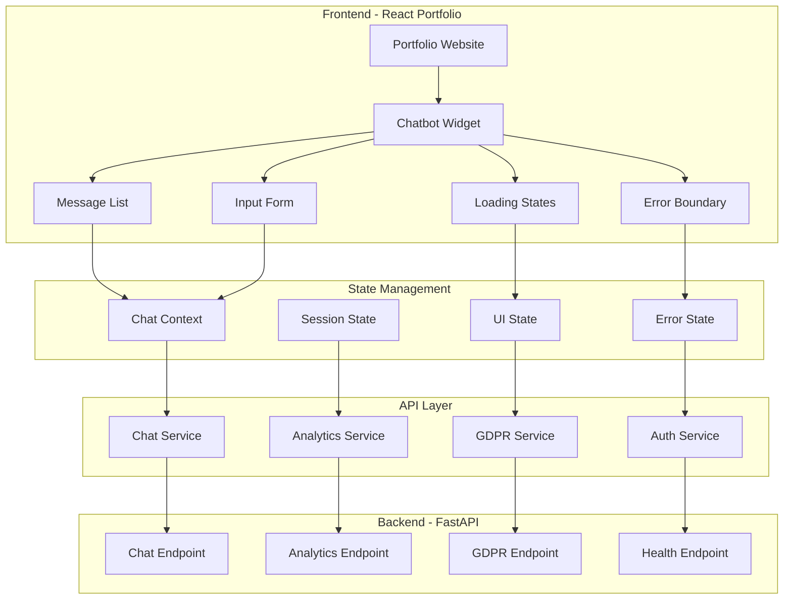

# 🎨 Integración Frontend - AI Resume Agent

## 📋 Resumen Ejecutivo

### Objetivo del Documento
Este documento detalla la integración completa del componente chatbot en el portfolio React existente, incluyendo componentes, servicios, estado y comunicación con el backend FastAPI.

### Tecnologías Utilizadas
- **Frontend**: React 18+ con TypeScript
- **Styling**: Tailwind CSS + Headless UI
- **State Management**: React Hooks + Context API
- **API Communication**: Axios + React Query
- **Backend Integration**: FastAPI + RAG + Analytics *(Privado con autenticación GCP)*

---

## 🏗️ Arquitectura Frontend-Backend

### **🎯 Integración React + FastAPI**



---

## 🧩 Componentes Principales

### **💬 ChatbotWidget**

**Propósito**: Componente principal que encapsula toda la funcionalidad del chatbot.

```typescript
interface ChatbotWidgetProps {
  isOpen: boolean;
  onToggle: () => void;
  initialMessage?: string;
  userType?: UserType;
  onDataCapture?: (data: UserData) => void;
  onGDPRConsent?: (consent: GDPRConsent) => void;
}

const ChatbotWidget: React.FC<ChatbotWidgetProps> = ({
  isOpen,
  onToggle,
  initialMessage,
  userType = 'IT',
  onDataCapture,
  onGDPRConsent
}) => {
  const { messages, sendMessage, isLoading, error } = useChat();
  const { sessionId, flowState } = useSession();
  
  return (
    <div className={`fixed bottom-4 right-4 z-50 ${isOpen ? 'block' : 'hidden'}`}>
      <div className="bg-white rounded-lg shadow-lg w-96 h-96 flex flex-col">
        <ChatHeader onClose={onToggle} />
        <MessageList messages={messages} />
        <InputForm 
          onSendMessage={sendMessage}
          isLoading={isLoading}
          disabled={error !== null}
        />
        <LoadingIndicator isLoading={isLoading} />
        <ErrorDisplay error={error} />
      </div>
    </div>
  );
};
```

### **📝 MessageList**

**Propósito**: Renderiza la lista de mensajes con scroll automático y animaciones.

```typescript
interface Message {
  id: string;
  type: 'user' | 'bot';
  content: string;
  timestamp: Date;
  sources?: SourceDocument[];
  responseTime?: number;
}

const MessageList: React.FC<{ messages: Message[] }> = ({ messages }) => {
  const messagesEndRef = useRef<HTMLDivElement>(null);
  
  useEffect(() => {
    messagesEndRef.current?.scrollIntoView({ behavior: 'smooth' });
  }, [messages]);
  
  return (
    <div className="flex-1 overflow-y-auto p-4 space-y-4">
      {messages.map((message) => (
        <MessageBubble key={message.id} message={message} />
      ))}
      <div ref={messagesEndRef} />
    </div>
  );
};
```

### **💭 MessageBubble**

**Propósito**: Componente individual para cada mensaje con estilos diferenciados.

```typescript
const MessageBubble: React.FC<{ message: Message }> = ({ message }) => {
  const isUser = message.type === 'user';
  
  return (
    <motion.div
      initial={{ opacity: 0, y: 20 }}
      animate={{ opacity: 1, y: 0 }}
      className={`flex ${isUser ? 'justify-end' : 'justify-start'}`}
    >
      <div className={`max-w-xs px-4 py-2 rounded-lg ${
        isUser 
          ? 'bg-blue-500 text-white' 
          : 'bg-gray-100 text-gray-800'
      }`}>
        <p className="text-sm">{message.content}</p>
        {message.sources && message.sources.length > 0 && (
          <SourceList sources={message.sources} />
        )}
        <span className="text-xs opacity-70">
          {formatTime(message.timestamp)}
        </span>
      </div>
    </motion.div>
  );
};
```

### **📤 InputForm**

**Propósito**: Formulario de entrada con validación y estados de carga.

```typescript
const InputForm: React.FC<{
  onSendMessage: (message: string) => void;
  isLoading: boolean;
  disabled: boolean;
}> = ({ onSendMessage, isLoading, disabled }) => {
  const [message, setMessage] = useState('');
  const [isTyping, setIsTyping] = useState(false);
  
  const handleSubmit = async (e: React.FormEvent) => {
    e.preventDefault();
    if (!message.trim() || isLoading || disabled) return;
    
    await onSendMessage(message.trim());
    setMessage('');
  };
  
  return (
    <form onSubmit={handleSubmit} className="p-4 border-t">
      <div className="flex space-x-2">
        <input
          type="text"
          value={message}
          onChange={(e) => setMessage(e.target.value)}
          placeholder="Escribe tu pregunta..."
          className="flex-1 px-3 py-2 border rounded-lg focus:outline-none focus:ring-2 focus:ring-blue-500"
          disabled={isLoading || disabled}
          maxLength={1000}
        />
        <button
          type="submit"
          disabled={!message.trim() || isLoading || disabled}
          className="px-4 py-2 bg-blue-500 text-white rounded-lg hover:bg-blue-600 disabled:opacity-50 disabled:cursor-not-allowed"
        >
          {isLoading ? <Spinner /> : <SendIcon />}
        </button>
      </div>
    </form>
  );
};
```

---

## 🔄 State Management

### **📊 Chat Context**

**Propósito**: Gestión centralizada del estado del chat y comunicación con la API.

```typescript
interface ChatContextType {
  messages: Message[];
  isLoading: boolean;
  error: string | null;
  sendMessage: (message: string) => Promise<void>;
  clearMessages: () => void;
  retryLastMessage: () => Promise<void>;
}

const ChatContext = createContext<ChatContextType | null>(null);

export const ChatProvider: React.FC<{ children: React.ReactNode }> = ({ children }) => {
  const [messages, setMessages] = useState<Message[]>([]);
  const [isLoading, setIsLoading] = useState(false);
  const [error, setError] = useState<string | null>(null);
  const [lastMessage, setLastMessage] = useState<string | null>(null);
  
  const { sessionId, userType } = useSession();
  const { mutate: sendChatMessage } = useMutation({
    mutationFn: chatService.sendMessage,
    onSuccess: (response) => {
      setMessages(prev => [...prev, {
        id: generateId(),
        type: 'bot',
        content: response.message,
        timestamp: new Date(),
        sources: response.sources,
        responseTime: response.response_time_ms
      }]);
      setIsLoading(false);
      setError(null);
    },
    onError: (error) => {
      setError(error.message);
      setIsLoading(false);
    }
  });
  
  const sendMessage = async (message: string) => {
    setLastMessage(message);
    setIsLoading(true);
    setError(null);
    
    // Agregar mensaje del usuario
    setMessages(prev => [...prev, {
      id: generateId(),
      type: 'user',
      content: message,
      timestamp: new Date()
    }]);
    
    // Enviar al backend
    sendChatMessage({
      message,
      session_id: sessionId,
      user_type: userType
    });
  };
  
  const retryLastMessage = async () => {
    if (lastMessage) {
      await sendMessage(lastMessage);
    }
  };
  
  const clearMessages = () => {
    setMessages([]);
    setError(null);
  };
  
  return (
    <ChatContext.Provider value={{
      messages,
      isLoading,
      error,
      sendMessage,
      clearMessages,
      retryLastMessage
    }}>
      {children}
    </ChatContext.Provider>
  );
};
```

### **🔐 Session Management**

**Propósito**: Gestión de sesiones y datos de usuario.

```typescript
interface SessionContextType {
  sessionId: string;
  userType: UserType;
  userData: UserData | null;
  flowState: FlowState;
  updateUserData: (data: Partial<UserData>) => void;
  updateFlowState: (state: FlowState) => void;
}

const SessionContext = createContext<SessionContextType | null>(null);

export const SessionProvider: React.FC<{ children: React.ReactNode }> = ({ children }) => {
  const [sessionId] = useState(() => generateSessionId());
  const [userType, setUserType] = useState<UserType>('IT');
  const [userData, setUserData] = useState<UserData | null>(null);
  const [flowState, setFlowState] = useState<FlowState>('conversation_active');
  
  const updateUserData = (data: Partial<UserData>) => {
    setUserData(prev => ({ ...prev, ...data }));
  };
  
  const updateFlowState = (state: FlowState) => {
    setFlowState(state);
  };
  
  return (
    <SessionContext.Provider value={{
      sessionId,
      userType,
      userData,
      flowState,
      updateUserData,
      updateFlowState
    }}>
      {children}
    </SessionContext.Provider>
  );
};
```

---

## 🌐 API Communication

### **📡 Chat Service**

**Propósito**: Servicio para comunicación con el endpoint de chat.

```typescript
interface ChatService {
  sendMessage(request: ChatRequest): Promise<ChatResponse>;
  getHealth(): Promise<HealthResponse>;
}

class ChatServiceImpl implements ChatService {
  private baseURL = 'https://chatbot-api-251107984645.europe-west1.run.app';
  private apiClient: AxiosInstance;
  
  constructor() {
    this.apiClient = axios.create({
      baseURL: this.baseURL,
      timeout: 30000,
      headers: {
        'Content-Type': 'application/json',
      }
    });
    
    // Interceptor para autenticación
    this.apiClient.interceptors.request.use(async (config) => {
      const token = await this.getAuthToken();
      if (token) {
        config.headers.Authorization = `Bearer ${token}`;
      }
      return config;
    });
    
    // Interceptor para manejo de errores
    this.apiClient.interceptors.response.use(
      (response) => response,
      (error) => {
        if (error.response?.status === 429) {
          throw new Error('Rate limit exceeded. Please try again later.');
        }
        if (error.response?.status === 503) {
          throw new Error('Service temporarily unavailable.');
        }
        throw error;
      }
    );
  }
  
  async sendMessage(request: ChatRequest): Promise<ChatResponse> {
    try {
      const response = await this.apiClient.post('/api/v1/chat', request);
      return response.data;
    } catch (error) {
      console.error('Error sending message:', error);
      throw error;
    }
  }
  
  async getHealth(): Promise<HealthResponse> {
    try {
      const response = await this.apiClient.get('/api/v1/health');
      return response.data;
    } catch (error) {
      console.error('Error checking health:', error);
      throw error;
    }
  }
  
  private async getAuthToken(): Promise<string | null> {
    // Implementación para obtener token de Google Cloud Identity
    // El backend es PRIVADO y requiere autenticación GCP nativa
    try {
      const response = await fetch('/api/auth/token');
      const data = await response.json();
      return data.token;
    } catch (error) {
      console.error('Error getting auth token:', error);
      return null;
    }
  }
}

export const chatService = new ChatServiceImpl();
```

### **📊 Analytics Service**

**Propósito**: Servicio para captura de datos y métricas.

```typescript
interface AnalyticsService {
  captureData(request: DataCaptureRequest): Promise<DataCaptureResponse>;
  getMetrics(days?: number): Promise<AnalyticsMetrics>;
  getSessions(filters?: SessionFilters): Promise<SessionListResponse>;
}

class AnalyticsServiceImpl implements AnalyticsService {
  private apiClient: AxiosInstance;
  
  constructor() {
    this.apiClient = axios.create({
      baseURL: 'https://chatbot-api-251107984645.europe-west1.run.app',
      timeout: 15000,
    });
  }
  
  async captureData(request: DataCaptureRequest): Promise<DataCaptureResponse> {
    try {
      const response = await this.apiClient.post('/api/v1/analytics/capture-data', request);
      return response.data;
    } catch (error) {
      console.error('Error capturing data:', error);
      throw error;
    }
  }
  
  async getMetrics(days: number = 7): Promise<AnalyticsMetrics> {
    try {
      const response = await this.apiClient.get(`/api/v1/analytics/metrics?days=${days}`);
      return response.data.metrics;
    } catch (error) {
      console.error('Error getting metrics:', error);
      throw error;
    }
  }
  
  async getSessions(filters?: SessionFilters): Promise<SessionListResponse> {
    try {
      const params = new URLSearchParams();
      if (filters?.limit) params.append('limit', filters.limit.toString());
      if (filters?.offset) params.append('offset', filters.offset.toString());
      if (filters?.userType) params.append('user_type', filters.userType);
      
      const response = await this.apiClient.get(`/api/v1/analytics/sessions?${params}`);
      return response.data;
    } catch (error) {
      console.error('Error getting sessions:', error);
      throw error;
    }
  }
}

export const analyticsService = new AnalyticsServiceImpl();
```

---

## 🔒 Seguridad y GDPR

### **🛡️ Input Validation**

**Propósito**: Validación y sanitización de inputs del usuario.

```typescript
import { z } from 'zod';

const MessageSchema = z.object({
  message: z.string()
    .min(1, 'Message cannot be empty')
    .max(1000, 'Message too long')
    .regex(/^[a-zA-Z0-9\s\?\!\.\,\:\;\-\(\)]+$/, 'Invalid characters detected'),
  session_id: z.string().optional(),
  user_type: z.enum(['IT', 'HR', 'Business', 'Other']).optional()
});

const DataCaptureSchema = z.object({
  email: z.string().email('Invalid email format'),
  user_type: z.enum(['IT', 'HR', 'Business', 'Other']),
  linkedin: z.string().url('Invalid LinkedIn URL').optional()
});

export const validateMessage = (data: unknown) => {
  return MessageSchema.parse(data);
};

export const validateDataCapture = (data: unknown) => {
  return DataCaptureSchema.parse(data);
};
```

### **🔐 GDPR Compliance**

**Propósito**: Implementación de derechos GDPR en el frontend.

```typescript
interface GDPRService {
  requestConsent(consentType: ConsentType): Promise<GDPRConsentResponse>;
  exportData(sessionId: string): Promise<GDPRExportResponse>;
  deleteData(sessionId: string): Promise<GDPRDeleteResponse>;
}

const GDPRConsentModal: React.FC<{
  isOpen: boolean;
  onAccept: () => void;
  onReject: () => void;
  consentType: ConsentType;
}> = ({ isOpen, onAccept, onReject, consentType }) => {
  if (!isOpen) return null;
  
  return (
    <div className="fixed inset-0 bg-black bg-opacity-50 flex items-center justify-center z-50">
      <div className="bg-white rounded-lg p-6 max-w-md mx-4">
        <h3 className="text-lg font-semibold mb-4">Consentimiento GDPR</h3>
        <p className="text-sm text-gray-600 mb-4">
          Para continuar, necesitamos tu consentimiento para procesar tus datos personales 
          de acuerdo con el Reglamento General de Protección de Datos (GDPR).
        </p>
        <div className="flex space-x-4">
          <button
            onClick={onAccept}
            className="px-4 py-2 bg-green-500 text-white rounded-lg hover:bg-green-600"
          >
            Aceptar
          </button>
          <button
            onClick={onReject}
            className="px-4 py-2 bg-red-500 text-white rounded-lg hover:bg-red-600"
          >
            Rechazar
          </button>
        </div>
      </div>
    </div>
  );
};
```

---

## 🎨 UI/UX Components

### **🎭 Animations y Transitions**

**Propósito**: Mejora de la experiencia de usuario con animaciones fluidas.

```typescript
import { motion, AnimatePresence } from 'framer-motion';

const ChatbotToggle: React.FC<{
  isOpen: boolean;
  onToggle: () => void;
}> = ({ isOpen, onToggle }) => {
  return (
    <motion.button
      onClick={onToggle}
      className="fixed bottom-4 right-4 w-14 h-14 bg-blue-500 text-white rounded-full shadow-lg hover:bg-blue-600 transition-colors"
      whileHover={{ scale: 1.1 }}
      whileTap={{ scale: 0.9 }}
      initial={{ scale: 0 }}
      animate={{ scale: 1 }}
      transition={{ type: "spring", stiffness: 260, damping: 20 }}
    >
      <AnimatePresence mode="wait">
        {isOpen ? (
          <motion.div
            key="close"
            initial={{ rotate: -90, opacity: 0 }}
            animate={{ rotate: 0, opacity: 1 }}
            exit={{ rotate: 90, opacity: 0 }}
            transition={{ duration: 0.2 }}
          >
            <CloseIcon />
          </motion.div>
        ) : (
          <motion.div
            key="open"
            initial={{ rotate: 90, opacity: 0 }}
            animate={{ rotate: 0, opacity: 1 }}
            exit={{ rotate: -90, opacity: 0 }}
            transition={{ duration: 0.2 }}
          >
            <ChatIcon />
          </motion.div>
        )}
      </AnimatePresence>
    </motion.button>
  );
};
```

### **📱 Responsive Design**

**Propósito**: Adaptación a diferentes tamaños de pantalla.

```typescript
const ChatbotWidget: React.FC<ChatbotWidgetProps> = (props) => {
  const [isMobile, setIsMobile] = useState(false);
  
  useEffect(() => {
    const checkMobile = () => {
      setIsMobile(window.innerWidth < 768);
    };
    
    checkMobile();
    window.addEventListener('resize', checkMobile);
    return () => window.removeEventListener('resize', checkMobile);
  }, []);
  
  return (
    <div className={`fixed z-50 ${
      isMobile 
        ? 'inset-0 bg-black bg-opacity-50 flex items-center justify-center p-4'
        : 'bottom-4 right-4'
    }`}>
      <div className={`bg-white rounded-lg shadow-lg flex flex-col ${
        isMobile ? 'w-full h-full max-w-md' : 'w-96 h-96'
      }`}>
        {/* Contenido del chatbot */}
      </div>
    </div>
  );
};
```

---

## 🧪 Testing

### **🔧 Testing Setup**

**Herramientas**:
- **Jest**: Framework de testing
- **React Testing Library**: Testing de componentes
- **MSW**: Mock Service Worker para API mocking
- **Cypress**: Testing end-to-end

```typescript
// Ejemplo de test de componente
import { render, screen, fireEvent, waitFor } from '@testing-library/react';
import { ChatbotWidget } from '../ChatbotWidget';

describe('ChatbotWidget', () => {
  it('should send message when form is submitted', async () => {
    const mockSendMessage = jest.fn();
    render(
      <ChatProvider>
        <ChatbotWidget isOpen={true} onToggle={jest.fn()} />
      </ChatProvider>
    );
    
    const input = screen.getByPlaceholderText('Escribe tu pregunta...');
    const button = screen.getByRole('button', { name: /enviar/i });
    
    fireEvent.change(input, { target: { value: 'Test message' } });
    fireEvent.click(button);
    
    await waitFor(() => {
      expect(mockSendMessage).toHaveBeenCalledWith('Test message');
    });
  });
});
```

### **🌐 API Mocking**

```typescript
// MSW setup para testing
import { rest } from 'msw';
import { setupServer } from 'msw/node';

const server = setupServer(
  rest.post('/api/v1/chat', (req, res, ctx) => {
    return res(
      ctx.json({
        message: 'Test response',
        session_id: 'test-session',
        timestamp: new Date().toISOString(),
        model: 'gemini-2.5-flash',
        response_time_ms: 1500,
        sources: [],
        flow_state: 'conversation_active',
        requires_data_capture: false,
        requires_gdpr_consent: false
      })
    );
  })
);

beforeAll(() => server.listen());
afterEach(() => server.resetHandlers());
afterAll(() => server.close());
```

---

## 📊 Performance Optimization

### **⚡ Optimizaciones Implementadas**

**Lazy Loading**:
```typescript
const ChatbotWidget = lazy(() => import('./ChatbotWidget'));

const App: React.FC = () => {
  return (
    <Suspense fallback={<div>Loading chatbot...</div>}>
      <ChatbotWidget />
    </Suspense>
  );
};
```

**Memoization**:
```typescript
const MessageBubble = memo<{ message: Message }>(({ message }) => {
  return (
    <div className="message-bubble">
      {message.content}
    </div>
  );
});
```

**Debouncing**:
```typescript
const useDebounce = (value: string, delay: number) => {
  const [debouncedValue, setDebouncedValue] = useState(value);
  
  useEffect(() => {
    const handler = setTimeout(() => {
      setDebouncedValue(value);
    }, delay);
    
    return () => clearTimeout(handler);
  }, [value, delay]);
  
  return debouncedValue;
};
```

---

## 🚀 Deployment y Integración

### **📦 Build Process**

```json
// package.json scripts
{
  "scripts": {
    "build": "vite build",
    "build:chatbot": "vite build --mode chatbot",
    "preview": "vite preview",
    "test": "jest",
    "test:e2e": "cypress run"
  }
}
```

### **🔗 Integración con Portfolio**

```typescript
// Integración en el portfolio principal
import { ChatbotProvider } from './chatbot/ChatbotProvider';
import { ChatbotWidget } from './chatbot/ChatbotWidget';

const PortfolioApp: React.FC = () => {
  const [isChatbotOpen, setIsChatbotOpen] = useState(false);
  
  return (
    <ChatbotProvider>
      <div className="portfolio-container">
        {/* Contenido del portfolio */}
        <ChatbotWidget 
          isOpen={isChatbotOpen}
          onToggle={() => setIsChatbotOpen(!isChatbotOpen)}
        />
      </div>
    </ChatbotProvider>
  );
};
```

---

## 📈 Métricas y Analytics

### **📊 Métricas Frontend**

**Performance Metrics**:
- **Time to Interactive**: < 3 segundos
- **First Contentful Paint**: < 1.5 segundos
- **Cumulative Layout Shift**: < 0.1
- **Bundle Size**: < 500KB gzipped

**User Experience Metrics**:
- **Message Response Time**: < 2 segundos
- **Error Rate**: < 1%
- **User Satisfaction**: > 4.5/5
- **Engagement Rate**: > 70%

